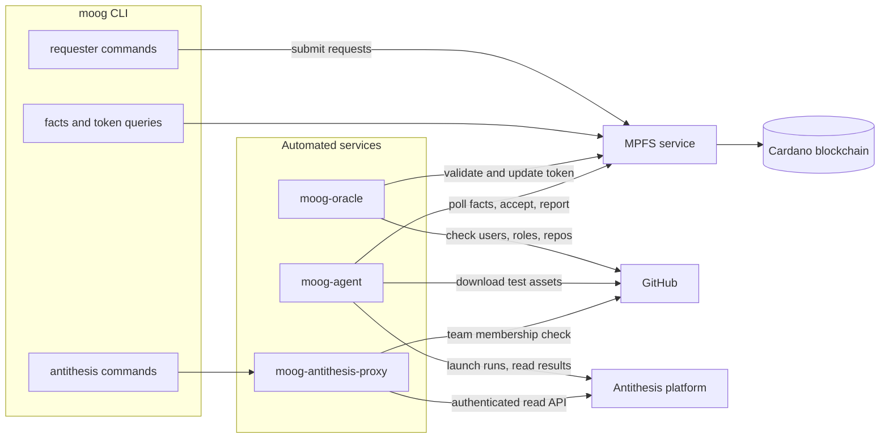

# Moog

> A tool to administer Antithesis test execution through Cardano.

<!-- Badges -->
[](https://github.com/cardano-foundation/moog/actions/workflows/unit-tests.yaml)
[](https://github.com/cardano-foundation/moog/actions/workflows/integration-tests.yaml)
[](https://github.com/cardano-foundation/moog/actions/workflows/E2E-test.yaml)
[](https://github.com/cardano-foundation/moog/actions/workflows/publish-site.yaml)
[](https://github.com/cardano-foundation/moog/actions/workflows/release.yml)
[](https://github.com/cardano-foundation/moog/actions/workflows/darwin-release.yml)
[](https://github.com/cardano-foundation/moog/actions/workflows/docker-images.yaml)


> **⚠️ Project state — MPFS v2 migration in progress.**
> moog is migrating from the legacy MPFS HTTP API to the new facts-only MPFS
> service ([cardano-mpfs-offchain](https://github.com/lambdasistemi/cardano-mpfs-offchain)),
> where the server returns indexed *facts* and the client builds, signs, and
> submits transactions. Current releases (**v0.5.1.5** at the time of writing)
> run against the **legacy** MPFS server in production; the oracle
> `token boot` / `token end` commands were removed in v0.5.1.3 because they
> already targeted the new API, which production does not yet serve
> ([#144](https://github.com/cardano-foundation/moog/issues/144)). The full
> client-side facts cutover is developed on the long-lived
> [`moog-v2`](https://github.com/cardano-foundation/moog/tree/moog-v2) branch.

## What is this

The [Cardano blockchain's][Cardano] core node software implements complex
algorithms and protocols who run in a networked, concurrent context. Many
nodes, some of which could be adversarial, collaborate to achieve the overall
system's behaviour of being a decentralized, immutable ledger. Such a system is
subject to many unpredictable factors such as communication delays, network
partitions, nodes appearing or disappearing.

[Antithesis][Antithesis] is a testing tool which is capable of generating
random events (such as communication delays, network partitions, nodes
appearing or disappearing) in a simulated environment, such that if any
specific random sequence of combination of events leads to a software error, it
can be reproduced.

Moog facilitates the use of Antithesis for testing components of the Cardano
ecosystem, while tracking these test efforts on the blockchain. It defines
three roles: **requesters** submit test-run requests, an **agent** runs them on
Antithesis and reports results, and an **oracle** validates every request
against GitHub and commits it to an on-chain token via the
[MPFS](https://github.com/cardano-foundation/mpfs) service.

## Architecture



The repository builds one CLI (`moog`) and three services: `moog-oracle`
(validates and batches on-chain requests), `moog-agent` (launches accepted
test runs on Antithesis and reconciles their results back on-chain), and
`moog-antithesis-proxy` (GitHub-team-authenticated read access to the
Antithesis API). See the
[architecture documentation](https://cardano-foundation.github.io/moog/ops/architecture/)
for details.

## Install

Download pre-built binaries for `moog`, `moog-agent` and `moog-oracle` from
the [releases page](https://github.com/cardano-foundation/moog/releases).
Each release ships Linux tarballs (`*-x86_64-linux-musl.tar.gz` and
`aarch64` variants, statically linked), AppImage/deb/rpm packages, and an
`aarch64-darwin` tarball for macOS.

Alternatively, Nix users can run the CLI directly from the repository:

```bash
nix shell github:cardano-foundation/moog#moog
```

## Quickstart

```bash
# check the CLI is installed
moog --help

# create a wallet (writes the mnemonics to wallet.json)
moog wallet create --wallet wallet.json

# inspect it (address and public key hash, never the mnemonics)
moog wallet info --wallet wallet.json

# point the CLI at the production MPFS service and moog token
export MOOG_MPFS_HOST=https://mpfs.plutimus.com
export MOOG_TOKEN_ID=21c523c3b4565f1fc1ad7e54e82ca976f60997d8e7e9946826813fabf341069b

# browse the public system state
moog facts users
```

Before requesting test runs you must register as a user and be granted a
role; the [User Manual][Moog] walks through the full setup.

## Usage

Moog is used via a command-line interface. The main command groups:

| Command group | Purpose |
|---|---|
| `moog wallet` | Create, inspect, encrypt and decrypt wallets |
| `moog requester` | Register users/roles and request test runs |
| `moog agent` | Accept, reject, push and report test runs |
| `moog oracle` | Update the token and publish the oracle configuration |
| `moog facts` | Query the on-chain system state (users, roles, test-runs, config) |
| `moog token` | Inspect the token state and pending requests |
| `moog retract` | Retract a pending request you own |
| `moog antithesis` | Read Antithesis run data through the proxy |

Run `moog --help` (or `moog <group> --help`) for the full reference, and see
the user manual on the [Moog website][Moog].

## Documentation

The full documentation — user manual, operations manual and developer docs —
is published at [cardano-foundation.github.io/moog][Moog].

For AI agents, start at [AGENTS.md](AGENTS.md).

## Development

```bash
nix develop        # dev shell with GHC, cabal, HLS, fourmolu, hlint, mkdocs
just build         # cabal build all --enable-tests
just unit          # run the unit test suite
just format        # fourmolu + cabal-fmt + nixfmt
```

See [CONTRIBUTING.md](./CONTRIBUTING.md) for building from source (with or
without Nix) and for the integration/E2E test setup.

## License

[Apache 2.0](./LICENSE)

## See also

- Test assets for running a Cardano network in Antithesis:
  [cardano-node-antithesis](https://github.com/cardano-foundation/cardano-node-antithesis)
- Other projects by [HAL][HAL] and the [Cardano Foundation][CF]
- About [Cardano][Cardano]

<!-- MARKDOWN LINKS & IMAGES -->

[Moog]: https://cardano-foundation.github.io/moog
[Antithesis]: https://antithesis.com
[HAL]: https://github.com/cardano-foundation/hal
[CF]: https://github.com/cardano-foundation
[Cardano]: https://cardano.org/
