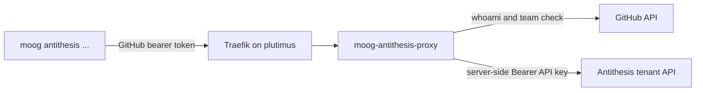

# Antithesis Proxy

`moog-antithesis-proxy` exposes the Antithesis tenant read API behind
GitHub team authorization. It keeps the Antithesis API key on plutimus
and accepts GitHub bearer tokens from clients such as
`moog antithesis runs`.



## Endpoints

All endpoints below sit behind the `pragma-org/antithesis-access` GitHub
team check. Public probe routes (`/healthz`, `/readyz`) require no
auth; everything else returns `401` for missing/invalid bearer tokens
and `403` for tokens whose owner is not an active team member.

| Path | Upstream shape | Notes |
|---|---|---|
| `GET /healthz` | `200 ok` | no auth |
| `GET /readyz` | `200 ready` / `503 not ready` | no auth; probes Antithesis + GitHub reachability |
| `GET /api/v0/openapi.json` | JSON | live OpenAPI spec from the Antithesis tenant — the authoritative schema for every other endpoint |
| `GET /api/v0/runs` | JSON | supports `?limit=` (max 100 upstream) and `?cursor=`; the response body carries `next_cursor` for follow-up calls |
| `GET /api/v0/runs/{run_id}` | JSON | single run detail; includes `failure_moment` for `incomplete` runs |
| `GET /api/v0/runs/{run_id}/properties` | JSON | pass/fail per property; **404 for `in_progress` runs** (Antithesis-side rule) |
| `GET /api/v0/runs/{run_id}/events?q=` | NDJSON | free-text substring search; upstream caps at 50 results |
| `GET /api/v0/runs/{run_id}/logs?input_hash=&vtime=` | NDJSON | logs at a specific moment |
| `GET /api/v0/runs/{run_id}/build_logs` | NDJSON | full build log stream |

The NDJSON endpoints stream upstream bytes through the proxy verbatim
(via Servant `StreamGet NoFraming PlainStream (SourceIO ByteString)`);
the proxy holds the upstream connection open through the WAI response
emission. Anything not in the table above returns `404`.

## CLI

The `moog antithesis` subcommand group on the moog binary derives its
client from the same Servant API the server serves, so the surfaces
stay in sync.

```text
moog antithesis runs   [--limit N] [--cursor S]
moog antithesis run    --run-id RUN_ID
moog antithesis properties  --run-id RUN_ID
moog antithesis events     --run-id RUN_ID [--q QUERY]
moog antithesis logs       --run-id RUN_ID [--input-hash HASH] [--vtime VTIME]
moog antithesis build-logs --run-id RUN_ID
```

JSON commands emit canonical JSON on `stdout`. NDJSON commands stream
upstream bytes verbatim to `stdout` (so each line is one JSON record)
inside a `Servant.Client.Streaming.withClientM` callback that keeps the
upstream connection alive for the full drain.

Exit codes:

- `0` success
- `2` authorization or SSO failure (`401`/`403` from the proxy)
- `3` proxy or network failure (`5xx` or transport error)
- `4` proxy returned a non-JSON body where JSON was expected

### Pagination

```bash
moog antithesis runs --limit 100 \
  | jq -r '.next_cursor // empty' \
  | xargs -r -I{} moog antithesis runs --limit 100 --cursor {}
```

The cursor is opaque; clients echo it back verbatim. Loop until
`next_cursor` is absent.

### First-time use

The first invocation triggers GitHub device-flow login against the
`lambdasistemi`-owned `moog` OAuth App; the resulting OAuth token is
cached at `~/.config/moog/github-oauth.json` (mode `0600`). Subsequent
calls reuse it. If a `pragma-org` admin hasn't approved the `moog` App
yet, the proxy returns `502 github membership check failed`; visit
<https://github.com/settings/connections/applications/Ov23liVVFVtdBez1QDxq>
and click "Request approval" for the `pragma-org` entry under
"Organization access" — once a `pragma-org` admin approves it, every
team member can use the proxy.

## Repository Artifacts

- Image: `ghcr.io/cardano-foundation/moog/moog-antithesis-proxy:<tag>`.
- Compose example: `docs/antithesis-proxy.compose.example.yaml`.
- Runtime port: `8080`.
- Public route: `https://antithesis-proxy.plutimus.com`.

Pin `MOOG_VERSION` to a concrete commit or release tag. Do not deploy
`latest`.

## Upstream API model

The proxy forwards to `amaru-cardano.antithesis.com/api/v0/...` by
default, attaching the server-held Antithesis API key as
`Authorization: Bearer <key>`. The API key is **different** from the
`pragma:<password>` basic-auth pair `moog-agent` uses to call
`POST /api/v1/launch/<launcher>`; the launch pair is not valid for the
read API.

Obtain the API key from Antithesis support or from your forward-deployed
engineer.

## Plutimus Layout

Copy the compose example to:

```text
/opt/hal/infrastructure/moog/antithesis-proxy/docker-compose.yaml
```

Create the secrets layout:

```text
/secrets/moog-antithesis-proxy/
  new/
    antithesis-api-key
  old/
    antithesis-api-key
```

`antithesis-api-key` is the plain-text value read by
`MOOG_ANTITHESIS_API_KEY_FILE` (default
`/run/secrets/antithesis-api-key`).

## Deploy

```bash
cd /opt/hal/infrastructure/moog/antithesis-proxy
MOOG_VERSION=<pinned-tag> docker compose pull moog-antithesis-proxy
MOOG_VERSION=<pinned-tag> docker compose up -d moog-antithesis-proxy
```

Restart the service after config or secret changes:

```bash
MOOG_VERSION=<pinned-tag> docker compose up -d --force-recreate moog-antithesis-proxy
```

Stop it with:

```bash
docker compose down
```

Read logs with:

```bash
docker logs antithesis-proxy-moog-antithesis-proxy-1
```

Each request emits one structured JSON line:

```json
{"login":"paolino","path":"/api/v0/runs","status":200,"upstream_status":200,"latency_ms":1641,"request_id":"-","ts":"…"}
```

## Acceptance Checks

```bash
curl -i https://antithesis-proxy.plutimus.com/healthz
curl -i https://antithesis-proxy.plutimus.com/api/v0/runs
curl -i -H 'Authorization: Bearer garbage' \
  https://antithesis-proxy.plutimus.com/api/v0/runs
TOK=$(jq -r .access_token ~/.config/moog/github-oauth.json)
curl -i -H "Authorization: Bearer $TOK" \
  https://antithesis-proxy.plutimus.com/api/v0/runs?limit=1
```

Expected results:

- `/healthz` returns `200` with body `ok`.
- `/api/v0/runs` without auth returns `401` and
  `WWW-Authenticate: Bearer realm="moog-antithesis-proxy"`.
- `/api/v0/runs` with garbage auth returns `401`.
- `/api/v0/runs` with a valid `pragma-org/antithesis-access` member
  token returns `200` and the Antithesis runs JSON body.

Detail and streaming endpoints can be probed by substituting the
`run_id` returned in the first response.

## Secret rotation

Rotate the Antithesis API key by mirroring the `moog-agent` rotation
pattern: write the new value to
`/secrets/moog-antithesis-proxy/new/antithesis-api-key`, move the
previous file to `old/`, then force-recreate the container.

```bash
read -rs KEY
printf '%s' "$KEY" \
  | sudo tee /secrets/moog-antithesis-proxy/new/antithesis-api-key >/dev/null
unset KEY
sudo chmod 0400 /secrets/moog-antithesis-proxy/new/antithesis-api-key
cd /opt/hal/infrastructure/moog/antithesis-proxy
MOOG_VERSION=<pinned-tag> sudo -E docker compose up -d --force-recreate moog-antithesis-proxy
```

## Architecture

The proxy and its CLI clients are all derived from a single
`AntithesisProxyAPI` type defined in `Proxy.Antithesis.Api`. That type
is the concatenation of two sub-APIs:

- `AntithesisProxyJsonAPI` — the three JSON endpoints, exposed with
  `Get '[PlainJSON] Value`. Both the proxy server and the CLI talk to
  the upstream via the regular non-streaming
  `Servant.Client.ClientM`. The proxy server hoists the auto-derived
  upstream client into the Servant `Handler` monad — every JSON
  handler is a one-line `runUpstream env (clientFn args…)`.

- `AntithesisProxyStreamAPI` — the three NDJSON endpoints, exposed
  with `StreamGet NoFraming PlainStream (SourceIO ByteString)`. The
  CLI uses `Servant.Client.Streaming.withClientM` to drain the
  `SourceIO` to stdout. The proxy server uses `http-client` directly
  to open an upstream streaming response and wrap its body reader as
  a `SourceIO ByteString`, so the upstream TCP connection stays alive
  while Servant's WAI server emits frames downstream.

The split exists because `servant-client` and
`servant-client-streaming` ship two distinct `ClientM` monads; an API
combining `Get` and `StreamGet` cannot be derived under a single one.
Splitting at the API-type level lets the JSON and streaming halves
each pick their natural transport while still sharing all path
fragments and Capture / QueryParam types.

## Upstream documentation

The Antithesis tenant is the source of truth for the data shapes. The
proxy passes payloads through verbatim, so the upstream schema is also
the proxy's schema.

- **Live OpenAPI spec** — `GET /api/v0/openapi.json` on the proxy
  returns the tenant's own OpenAPI document. Team members can fetch
  it without holding the API key:

  ```bash
  TOK=$(jq -r .access_token ~/.config/moog/github-oauth.json)
  curl -sS -H "Authorization: Bearer $TOK" \
    https://antithesis-proxy.plutimus.com/api/v0/openapi.json \
    | jq '.paths | keys'
  ```

  Equivalently, operators with the Antithesis API key can dump the
  spec directly with `anti openapi` from the `antithesis-api` skill.

- **`antithesis-api` skill** — sibling skill in this repo's operator
  toolkit. It carries the human-friendly recipes (`anti runs`,
  `anti properties`, `anti events`, `anti logs`, `anti report-url`)
  and the per-endpoint response-shape notes that don't fit in an
  OpenAPI doc (e.g. the embedded-JSON `description` field on a run,
  the `failure_moment` semantics for incomplete runs, the
  free-text-only nature of `events?q=`, and the 50-result cap).

- **Triage report URL** — every run object's `links.triage_report`
  field is a ready-to-open browser URL on the tenant
  (`https://amaru-cardano.antithesis.com/report/…`). The
  authorisation token is baked into the URL itself; no separate
  Antithesis SSO login is required to view it.

## Live Deployment Status

The proxy is deployed and healthy on plutimus. Operators can verify
the public health endpoint at
<https://antithesis-proxy.plutimus.com/healthz>. The full end-to-end
smoke (device-flow login from a clean container + `moog antithesis
runs`) is covered by the `antithesis-api` skill's `anti runs` flow
once a member of `pragma-org/antithesis-access` has authorized the
`moog` OAuth App.
