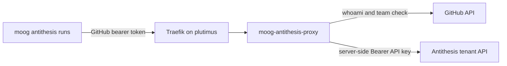

# Antithesis Proxy Deployment

`moog-antithesis-proxy` exposes the Antithesis tenant read API behind GitHub
team authorization. It keeps the Antithesis API key on plutimus and accepts
GitHub bearer tokens from clients such as `moog antithesis runs`.



## Repository Artifacts

- Image: `ghcr.io/cardano-foundation/moog/moog-antithesis-proxy:<tag>`.
- Compose example: `docs/antithesis-proxy.compose.example.yaml`.
- Runtime port: `8080`.
- Public route: `https://antithesis-proxy.plutimus.com`.

Pin `MOOG_VERSION` to a concrete commit or release tag. Do not deploy
`latest`.

## Upstream API model

The proxy forwards `GET /api/v0/runs` (the live read endpoint per the
`antithesis-api` skill) on the tenant host (`amaru-cardano.antithesis.com`
by default), attaching the server-held Antithesis API key as
`Authorization: Bearer <key>`. The API key is **different** from the
`pragma:<password>` basic-auth pair `moog-agent` uses to call
`POST /api/v1/launch/<launcher>`; the launch pair is not valid for the
read API.

Obtain the API key from Antithesis support or from your forward-deployed
engineer.

## Plutimus Layout

Copy the compose example to:

```text
/opt/hal/infrastructure/moog/antithesis-proxy/docker-compose.yaml
```

Create the secrets layout:

```text
/secrets/moog-antithesis-proxy/
  new/
    antithesis-api-key
  old/
    antithesis-api-key
```

`antithesis-api-key` is the plain-text value read by
`MOOG_ANTITHESIS_API_KEY_FILE` (default
`/run/secrets/antithesis-api-key`).

## Deploy

```bash
cd /opt/hal/infrastructure/moog/antithesis-proxy
MOOG_VERSION=<pinned-tag> docker compose pull moog-antithesis-proxy
MOOG_VERSION=<pinned-tag> docker compose up -d moog-antithesis-proxy
```

Restart the service after config or secret changes:

```bash
MOOG_VERSION=<pinned-tag> docker compose up -d --force-recreate moog-antithesis-proxy
```

Stop it with:

```bash
docker compose down
```

Read logs with:

```bash
docker logs antithesis-proxy-moog-antithesis-proxy-1
```

## Acceptance Checks

```bash
curl -i https://antithesis-proxy.plutimus.com/healthz
curl -i https://antithesis-proxy.plutimus.com/api/v0/runs
curl -i -H 'Authorization: Bearer garbage' \
  https://antithesis-proxy.plutimus.com/api/v0/runs
curl -i -H "Authorization: Bearer ${GITHUB_TOKEN}" \
  https://antithesis-proxy.plutimus.com/api/v0/runs
```

Expected results:

- `/healthz` returns `200` with body `ok`.
- `/api/v0/runs` without auth returns `401` and
  `WWW-Authenticate: Bearer realm="moog-antithesis-proxy"`.
- `/api/v0/runs` with garbage auth returns `401`.
- `/api/v0/runs` with a valid `pragma-org/antithesis-access` member token
  returns `200` and the Antithesis runs JSON body.

## Secret rotation

Rotate the Antithesis API key by mirroring the `moog-agent` rotation
pattern: write the new value to
`/secrets/moog-antithesis-proxy/new/antithesis-api-key`, move the previous
file to `old/`, then force-recreate the container.

```bash
read -rs KEY
printf '%s' "$KEY" \
  | sudo tee /secrets/moog-antithesis-proxy/new/antithesis-api-key >/dev/null
unset KEY
sudo chmod 0400 /secrets/moog-antithesis-proxy/new/antithesis-api-key
cd /opt/hal/infrastructure/moog/antithesis-proxy
MOOG_VERSION=<pinned-tag> sudo -E docker compose up -d --force-recreate moog-antithesis-proxy
```

## Live Deployment Status

The proxy is deployed and healthy on plutimus. Operators can verify the
public health endpoint at
`https://antithesis-proxy.plutimus.com/healthz`. The full end-to-end smoke
(device-flow login from a clean container + `moog antithesis runs`) is
covered by the `antithesis-api` skill's `anti runs` flow once a member of
`pragma-org/antithesis-access` has authorized the `moog` OAuth App.
