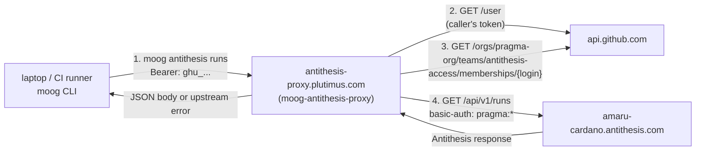

# Antithesis Proxy Runbook

`moog-antithesis-proxy` exposes selected Antithesis tenant API routes behind
GitHub team authorization. It keeps the Antithesis tenant password on
plutimus and accepts GitHub bearer tokens from clients such as
`moog antithesis runs`.

This runbook is the operator surface for
[epic #109](https://github.com/cardano-foundation/moog/issues/109).

## Architecture



The proxy allows only members of the GitHub team
`pragma-org/antithesis-access`. The client obtains its GitHub token with
GitHub OAuth Device Flow, caches it at `~/.config/moog/github-oauth.json`,
and sends it to the proxy as a bearer token. The proxy calls GitHub
`GET /user` and the team membership endpoint on every uncached token, then
forwards allowed requests to Antithesis with server-held basic auth.

## Repository Artifacts

- Image: `ghcr.io/cardano-foundation/moog/moog-antithesis-proxy:<tag>`.
- Compose example: `docs/antithesis-proxy.compose.example.yaml`.
- Runtime port: `8080`.
- Public route: `https://antithesis-proxy.plutimus.com`.
- CLI default proxy URL: `https://antithesis-proxy.plutimus.com`.
- OAuth App client ID embedded in the `moog antithesis` CLI:
  `Ov23liVVFVtdBez1QDxq`.

Pin `MOOG_VERSION` to a concrete commit or release tag. Do not deploy
`latest`.

## Plutimus Layout

Copy the compose example to:

```text
/opt/hal/infrastructure/moog/antithesis-proxy/docker-compose.yaml
```

Create the secrets layout:

```text
/secrets/moog-antithesis-proxy/
  new/
    secrets.yaml
    antithesis-password
  old/
    secrets.yaml
    antithesis-password
```

`secrets.yaml` mirrors the agent rotation discipline and carries:

```yaml
antithesisPassword: "<same value as moog-agent>"
```

`antithesis-password` is the plain-text value read by
`MOOG_ANTITHESIS_PASSWORD_FILE`.

The Antithesis password is shared with `moog-agent` on the `agent` host.
Rotate the proxy and agent copies together, or deliberately document a
short-lived staged rotation. A half-rotated tenant tuple can look like a
generic upstream `403`.

## Deploy

```bash
cd /opt/hal/infrastructure/moog/antithesis-proxy
MOOG_VERSION=<pinned-tag> sudo docker compose pull moog-antithesis-proxy
MOOG_VERSION=<pinned-tag> sudo docker compose up -d moog-antithesis-proxy
```

Restart the service after config or secret changes:

```bash
cd /opt/hal/infrastructure/moog/antithesis-proxy
MOOG_VERSION=<pinned-tag> sudo docker compose up -d --force-recreate moog-antithesis-proxy
```

Stop it with:

```bash
cd /opt/hal/infrastructure/moog/antithesis-proxy
sudo docker compose down
```

Read logs with:

```bash
sudo docker logs antithesis-proxy-moog-antithesis-proxy-1
```

## Grant User Access

Access is granted in GitHub, not in Moog and not on plutimus.

1. Ask a `pragma-org` organization administrator to add the user to the
   `pragma-org/antithesis-access` team.
2. If `pragma-org` requires SSO authorization for OAuth Apps, ask the user
   to authorize the Moog OAuth App for the organization before retrying.
3. The user runs `moog antithesis runs`. On first use, the CLI prints the
   GitHub device-flow URL and code, then stores the token at
   `~/.config/moog/github-oauth.json` with mode `0600`.
4. If the user was just added to the team and still receives `403`, wait for
   the proxy's short membership cache to expire or recreate the proxy.

To remove access, remove the user from `pragma-org/antithesis-access`. No
Moog-side secret or config change is required.

## First-Time SSO Authorization

If GitHub reports that SSO is required, the proxy returns `403` with:

```text
X-Moog-SSO-Url: <github authorization URL>
```

The CLI renders that URL as part of the authorization failure. The user must
open the URL, authorize the OAuth App for `pragma-org`, and re-run
`moog antithesis runs`. A plain `403 forbidden` without `X-Moog-SSO-Url`
usually means the GitHub account is not an active member of
`pragma-org/antithesis-access`.

## Rotate Antithesis Password

Use the same discipline as the `moog-agent` Antithesis password rotation:
verify the new tenant password against Antithesis before changing running
services, never put the secret in a command literal, and force-recreate
containers because compose secrets are materialized when the container is
created.

Verify the candidate password first:

```bash
read -rs NEWPW
STATUS=$(curl -sS -o /dev/null -w "%{http_code}" -u "pragma:${NEWPW}" \
  -X POST https://amaru-cardano.antithesis.com/api/v1/launch/amaru-cardano \
  -H "Content-Type: application/json" -d "{}")
[ "$STATUS" = "200" ] && echo "OK - proceeding" || { echo "REJECTED status=$STATUS"; unset NEWPW; false; }
```

Rotate the proxy copy without placing the password in the remote argv:

```bash
printf '%s\n' "$NEWPW" | ssh plutimus '
  sudo sh -c '"'"'
    P=$(cat)
    sed -i "s|^antithesisPassword:.*|antithesisPassword: \"$P\"|" /secrets/moog-antithesis-proxy/new/secrets.yaml
    printf %s "$P" > /secrets/moog-antithesis-proxy/new/antithesis-password
    chmod 0400 /secrets/moog-antithesis-proxy/new/antithesis-password
    cd /opt/hal/infrastructure/moog/antithesis-proxy
    docker compose up -d --force-recreate moog-antithesis-proxy
  '"'"'
'
```

Rotate the matching `moog-agent` copy on the `agent` host in the same
maintenance window, following the `antithesis-moog` operator skill. Then
clear the local shell variable:

```bash
unset NEWPW
```

Verify both paths:

```bash
ssh plutimus 'sudo docker logs --since 120s antithesis-proxy-moog-antithesis-proxy-1 2>&1 | grep -iE "403|forbidden|error|upstream" | tail'
ssh agent 'sudo docker logs --since 120s agent-moog-agent-1 2>&1 | grep -iE "PostToAntithesisFailure|403|forbidden" | tail'
```

## Rotate OAuth App Client ID

The CLI embeds the OAuth App client ID
`Ov23liVVFVtdBez1QDxq` in `src/User/Antithesis/Constants.hs`. Rotating the
OAuth App is a client release, not a plutimus-only operation.

1. Register the replacement GitHub OAuth App under the owning account and
   approve it for `pragma-org` if organization policy requires approval.
2. Change the embedded client ID in the Moog CLI.
3. Build and release new Moog binaries.
4. Keep the old OAuth App registered until all expected operators have
   upgraded or until the announced deprecation window ends.
5. After disabling the old OAuth App, users with old cached tokens will need
   to upgrade and complete device flow again.

The proxy does not need a matching client-id setting. It validates whatever
GitHub bearer token the client presents.

## Acceptance Checks

```bash
curl -i https://antithesis-proxy.plutimus.com/healthz
curl -i https://antithesis-proxy.plutimus.com/api/v1/runs
curl -i -H 'Authorization: Bearer garbage' \
  https://antithesis-proxy.plutimus.com/api/v1/runs
curl -i -H "Authorization: Bearer ${GITHUB_TOKEN}" \
  https://antithesis-proxy.plutimus.com/api/v1/runs
```

Expected results today:

- `/healthz` returns `200` with body `ok`.
- `/api/v1/runs` without auth returns `401` and
  `WWW-Authenticate: Bearer realm="moog-antithesis-proxy"`.
- `/api/v1/runs` with garbage auth returns `401` with body
  `invalid token`.
- `/api/v1/runs` with a valid `pragma-org/antithesis-access` member token
  proves GitHub `whoami` and team membership when the proxy audit log includes
  the caller login and an `upstream_status`.
- The forwarded `/api/v1/runs` request currently receives `403` from
  Antithesis upstream because that tenant endpoint is not exposed yet. Track
  the Antithesis-side blocker in
  [issue #78](https://github.com/cardano-foundation/moog/issues/78).

The #115 deployment evidence in A-004 validated the first three curls and
showed the fourth curl passing the proxy auth gate as `login:paolino` before
Antithesis returned upstream `403`. Until Antithesis ships `/api/v1/runs`,
the live-boundary proof for this proxy is the proxy audit entry plus the
upstream caveat, not a `200` JSON run list.

## Device-Flow Smoke

### #116 Readiness Decision

For #116, the pre-merge live-boundary evidence is accepted as:

- #111 proved the lambdasistemi-owned OAuth App client ID
  `Ov23liVVFVtdBez1QDxq` can complete GitHub Device Flow against github.com.
- A-004 proved the deployed proxy at
  `https://antithesis-proxy.plutimus.com` validates a real
  `pragma-org/antithesis-access` member token, records the caller login in
  the audit log, and forwards to Antithesis.
- A-004 also proved that the remaining live failure is upstream
  `403` from Antithesis for `/api/v1/runs`, tracked by #78.

A fresh `moog antithesis runs` smoke before #78 is fixed would still be
useful as an operator rehearsal, but it cannot satisfy the original "200 JSON
run list" criterion because the upstream endpoint is not shipped. The
required repeat smoke after #78 is the procedure below.

Run this from a clean environment with no cached
`~/.config/moog/github-oauth.json`:

```bash
moog antithesis runs
```

Expected behavior while `/api/v1/runs` is still blocked upstream:

1. The CLI prints the GitHub device-flow URL and user code.
2. The operator approves the request in a browser.
3. The CLI stores the GitHub token at `~/.config/moog/github-oauth.json`
   with mode `0600`.
4. The CLI calls `https://antithesis-proxy.plutimus.com/api/v1/runs`.
5. The proxy audit log shows the GitHub login and a forwarded request.
6. The command exits with an authorization failure because Antithesis returns
   upstream `403` for `/api/v1/runs`.

After Antithesis ships `/api/v1/runs`, repeat the same smoke and require a
`200` JSON body from `moog antithesis runs`. Re-run the command in the same
environment and verify that the second invocation skips device flow. Revoke
the OAuth grant at `https://github.com/settings/applications`, re-run, and
verify that the CLI re-runs device flow after the proxy rejects the stale
token.

## Non-Member Check

From a clean environment, ask a GitHub user who is not in
`pragma-org/antithesis-access` to run:

```bash
moog antithesis runs
```

After device-flow approval, the expected result is a CLI authorization error
with proxy body `forbidden` and exit code `2`. The proxy log should not show a
forwarded Antithesis request for that user.

## Common Failures

| Symptom | Likely cause | Action |
|---|---|---|
| `SSO URL: ...` in CLI output | GitHub requires OAuth App SSO authorization for `pragma-org` | Open the URL, authorize the app, and retry. |
| `proxy rejected refreshed GitHub token with 401` | Cached token expired, OAuth grant revoked, or GitHub rejected the refreshed token | Re-run the command to trigger device flow; if it persists, remove `~/.config/moog/github-oauth.json` and retry. |
| `403 forbidden` from proxy | User is not an active `pragma-org/antithesis-access` member, or membership is pending | Add or activate the user in the GitHub team; wait for proxy cache expiry. |
| `403` with `upstream_status:403` in proxy audit log | Antithesis accepted the proxy request but rejected the upstream endpoint | For `/api/v1/runs`, this is the known #78 caveat until Antithesis ships the endpoint. |
| `502` from proxy | GitHub membership check failed unexpectedly or the upstream request failed before a response | Check proxy logs for `github membership check failed`, DNS, TLS, and upstream reachability. |
| `504` from proxy or Traefik | Proxy or upstream timed out | Check container health, Traefik logs, and Antithesis tenant availability. |
| Empty or non-JSON body from `moog antithesis runs` | Upstream returned a non-200 response or invalid JSON | Inspect the CLI stderr and proxy audit log request id. |

## Log Queries

Production logs, run on the production/plutimus host:

```bash
sudo docker logs antithesis-proxy-moog-antithesis-proxy-1
```

The same query over SSH:

```bash
ssh production 'sudo docker logs antithesis-proxy-moog-antithesis-proxy-1'
```

Recent warnings, errors, and upstream failures:

```bash
ssh production 'sudo docker logs --since 30m antithesis-proxy-moog-antithesis-proxy-1 2>&1 | grep -iE "error|failed|forbidden|upstream| 50[0-9] "'
```

JSON audit entries with upstream failures:

```bash
ssh production 'sudo docker logs --since 30m antithesis-proxy-moog-antithesis-proxy-1 2>&1 | jq -c "select(.upstream_status != null and .upstream_status >= 400)"'
```

Show requests for one GitHub login:

```bash
ssh production 'sudo docker logs --since 2h antithesis-proxy-moog-antithesis-proxy-1 2>&1 | jq -c "select(.login == \"paolino\")"'
```

Show healthcheck noise only:

```bash
ssh production 'sudo docker logs --since 10m antithesis-proxy-moog-antithesis-proxy-1 2>&1 | jq -c "select(.path == \"/healthz\")"'
```

If `jq` reports parse errors, the container emitted non-JSON startup or
runtime text. Re-run without `jq` and inspect the surrounding lines.

## Live Deployment Status

The proxy is deployed and healthy on plutimus. Operators can verify the
public health endpoint at:

```bash
curl -i https://antithesis-proxy.plutimus.com/healthz
```

As of the #115 deployment, three of the four acceptance curls validate the
live auth gate: `/healthz` returns `200 ok`, unauthenticated `/api/v1/runs`
returns the proxy's bearer challenge, and a garbage bearer token returns
`401`. A valid team-member token resolves through GitHub as `login:paolino`
in the proxy audit log, proving `whoami` and
`pragma-org/antithesis-access` membership succeeded before forwarding.

The forwarded `/api/v1/runs` request currently receives `403` from the
Antithesis upstream because that tenant endpoint is not exposed yet. This is
an Antithesis-side limitation tracked by
[issue #78](https://github.com/cardano-foundation/moog/issues/78), not a
proxy authorization failure.
