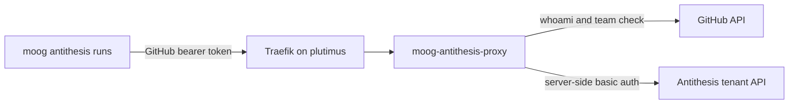

# Antithesis Proxy Deployment

`moog-antithesis-proxy` exposes selected Antithesis tenant API routes behind
GitHub team authorization. It keeps the Antithesis tenant password on
plutimus and accepts GitHub bearer tokens from clients such as
`moog antithesis runs`.



## Repository Artifacts

- Image: `ghcr.io/cardano-foundation/moog/moog-antithesis-proxy:<tag>`.
- Compose example: `docs/antithesis-proxy.compose.example.yaml`.
- Runtime port: `8080`.
- Public route: `https://antithesis-proxy.plutimus.com`.

Pin `MOOG_VERSION` to a concrete commit or release tag. Do not deploy
`latest`.

## Plutimus Layout

Copy the compose example to:

```text
/opt/hal/infrastructure/moog/antithesis-proxy/docker-compose.yaml
```

Create the secrets layout:

```text
/secrets/moog-antithesis-proxy/
  new/
    secrets.yaml
    antithesis-password
  old/
    secrets.yaml
    antithesis-password
```

`secrets.yaml` mirrors the agent rotation discipline and carries:

```yaml
antithesisPassword: "<same value as moog-agent>"
```

`antithesis-password` is the plain-text value read by
`MOOG_ANTITHESIS_PASSWORD_FILE`.

## Deploy

```bash
cd /opt/hal/infrastructure/moog/antithesis-proxy
MOOG_VERSION=<pinned-tag> docker compose pull moog-antithesis-proxy
MOOG_VERSION=<pinned-tag> docker compose up -d moog-antithesis-proxy
```

Restart the service after config or secret changes:

```bash
MOOG_VERSION=<pinned-tag> docker compose up -d --force-recreate moog-antithesis-proxy
```

Stop it with:

```bash
docker compose down
```

Read logs with:

```bash
docker logs antithesis-proxy-moog-antithesis-proxy-1
```

## Acceptance Checks

```bash
curl -i https://antithesis-proxy.plutimus.com/healthz
curl -i https://antithesis-proxy.plutimus.com/api/v1/runs
curl -i -H 'Authorization: Bearer garbage' \
  https://antithesis-proxy.plutimus.com/api/v1/runs
curl -i -H "Authorization: Bearer ${GITHUB_TOKEN}" \
  https://antithesis-proxy.plutimus.com/api/v1/runs
```

Expected results:

- `/healthz` returns `200` with body `ok`.
- `/api/v1/runs` without auth returns `401` and
  `WWW-Authenticate: Bearer realm="moog-antithesis-proxy"`.
- `/api/v1/runs` with garbage auth returns `401`.
- `/api/v1/runs` with a valid `pragma-org/antithesis-access` member token
  returns `200` and an Antithesis JSON body.

The full smoke script and failure-mode runbook are owned by #116.
