# Moog dependency graph

Computed from the Nix flake closure + `cabal.project` `source-repository-package` entries at locked revisions. Every edge is pinned to an exact commit hash.

## Repositories

| Repo | Owner | Description |
|------|-------|-------------|
| [**moog**](https://github.com/cardano-foundation/moog/tree/main) | cardano-foundation | Antithesis CLI |
| [**cardano-ledger-read**](https://github.com/cardano-foundation/cardano-ledger-read/tree/34d0767bd5c3) | cardano-foundation | Read Cardano block data, parametrized by era |
| [**cardano-mpfs-onchain**](https://github.com/cardano-foundation/cardano-mpfs-onchain/tree/457c1cbcbbf6) | cardano-foundation | Aiken on-chain validators for Merkle Patricia Forestry on Cardano |
| [**cardano-mpfs-offchain**](https://github.com/lambdasistemi/cardano-mpfs-offchain/tree/99cf2a29b4e6) | lambdasistemi | Fact CRUD, transaction building, devnet server for Merkle Patricia Forestry on Cardano |
| [**cardano-node-clients**](https://github.com/lambdasistemi/cardano-node-clients/tree/e4b01cb9efdf) | lambdasistemi | Haskell clients for Cardano node mini-protocols (N2C + N2N) |
| [**cardano-tx-tools**](https://github.com/lambdasistemi/cardano-tx-tools/tree/631f1341fde6) | lambdasistemi | Cardano transaction tooling: builder, structural diff, blueprint decoding. Uses cardano-node-clients but is not a node client. |
| [**cardano-utxo-csmt**](https://github.com/lambdasistemi/cardano-utxo-csmt/tree/f4772f73dde0) | lambdasistemi | HTTP service maintaining a Compact Sparse Merkle Tree over Cardano's UTxO set for efficient inclusion proofs |
| [**chain-follower**](https://github.com/lambdasistemi/chain-follower/tree/d592a5015f8d) | lambdasistemi | Abstract chain follower types — Follower, Intersector, ProgressOrRewind |
| [**contra-tracer-contrib**](https://github.com/lambdasistemi/contra-tracer-contrib/tree/f0518e871391) | lambdasistemi | Utility modules for contra-tracer: file logging, thread-safe wrappers, timestamps, throttling, and more |
| [**github-release-check**](https://github.com/lambdasistemi/github-release-check/tree/d90131112a4d) | lambdasistemi | Haskell library: check GitHub Releases API for newer versions of a CLI and print an update banner. Cache-aware, opt-out via env var, silent on failure. |
| [**haskell-mts**](https://github.com/lambdasistemi/haskell-mts/tree/ab15f7b2dea7) | lambdasistemi | Merkle Trees implementation in Haskell with persistent storage and Merkle proofs |
| [**rocksdb-haskell**](https://github.com/lambdasistemi/rocksdb-haskell/tree/a3e86b39f951) | lambdasistemi | RocksDB Haskell Bindings |
| [**rocksdb-kv-transactions**](https://github.com/lambdasistemi/rocksdb-kv-transactions/tree/e2e77579888e) | lambdasistemi | RocksDB backend for key-value transactions |
| [**aiken-codegen**](https://github.com/paolino/aiken-codegen/tree/74f364c10e93) | paolino | Haskell DSL for generating Aiken source code |
| [**dev-assets**](https://github.com/paolino/dev-assets/tree/b901b08ce8d2) | paolino | Actions for haskell, nix and mkdocs workflows |

## Flake inputs

### moog (root)

| Input | Target | Type | Source |
|-------|--------|------|--------|
| `dev-assets` | paolino/dev-assets `b901b08ce8d2` | flake | [flake.nix](https://github.com/cardano-foundation/moog/blob/main/flake.nix) |
| `mkdocs` | paolino/dev-assets `45d545c4b8b5` | flake | [flake.nix](https://github.com/cardano-foundation/moog/blob/main/flake.nix) |
| `asciinema` | paolino/dev-assets `45d545c4b8b5` | flake | [flake.nix](https://github.com/cardano-foundation/moog/blob/main/flake.nix) |

## Cabal source-repository-package

### cardano-foundation/moog @ `main`

| Dependency | Locked tag | Source |
|------------|-----------|--------|
| cardano-foundation/cardano-ledger-read | `34d0767bd5c3` | [cabal.project:72](https://github.com/cardano-foundation/moog/blob/main/cabal.project#L72) |
| cardano-foundation/cardano-mpfs-onchain | `457c1cbcbbf6` | [cabal.project:127](https://github.com/cardano-foundation/moog/blob/main/cabal.project#L127) |
| lambdasistemi/cardano-mpfs-offchain | `99cf2a29b4e6` | [cabal.project:13](https://github.com/cardano-foundation/moog/blob/main/cabal.project#L13) |
| lambdasistemi/cardano-node-clients | `e4b01cb9efdf` | [cabal.project:115](https://github.com/cardano-foundation/moog/blob/main/cabal.project#L115) |
| lambdasistemi/cardano-tx-tools | `631f1341fde6` | [cabal.project:85](https://github.com/cardano-foundation/moog/blob/main/cabal.project#L85) |
| lambdasistemi/cardano-utxo-csmt | `f4772f73dde0` | [cabal.project:91](https://github.com/cardano-foundation/moog/blob/main/cabal.project#L91) |
| lambdasistemi/chain-follower | `d592a5015f8d` | [cabal.project:47](https://github.com/cardano-foundation/moog/blob/main/cabal.project#L47) |
| lambdasistemi/contra-tracer-contrib | `f0518e871391` | [cabal.project:121](https://github.com/cardano-foundation/moog/blob/main/cabal.project#L121) |
| lambdasistemi/github-release-check | `d90131112a4d` | [cabal.project:97](https://github.com/cardano-foundation/moog/blob/main/cabal.project#L97) |
| lambdasistemi/haskell-mts | `ab15f7b2dea7` | [cabal.project:53](https://github.com/cardano-foundation/moog/blob/main/cabal.project#L53) |
| lambdasistemi/rocksdb-haskell | `a3e86b39f951` | [cabal.project:35](https://github.com/cardano-foundation/moog/blob/main/cabal.project#L35) |
| lambdasistemi/rocksdb-kv-transactions | `e2e77579888e` | [cabal.project:41](https://github.com/cardano-foundation/moog/blob/main/cabal.project#L41) |
| paolino/aiken-codegen | `74f364c10e93` | [cabal.project:66](https://github.com/cardano-foundation/moog/blob/main/cabal.project#L66) |

### lambdasistemi/cardano-mpfs-offchain @ `99cf2a29b4e6`

| Dependency | Locked tag | Source |
|------------|-----------|--------|
| cardano-foundation/cardano-ledger-read | `34d0767bd5c3` | [cabal.project:65](https://github.com/lambdasistemi/cardano-mpfs-offchain/blob/99cf2a29b4e6/cabal.project#L65) |
| cardano-foundation/cardano-mpfs-onchain | `457c1cbcbbf6` | [cabal.project:95](https://github.com/lambdasistemi/cardano-mpfs-offchain/blob/99cf2a29b4e6/cabal.project#L95) |
| lambdasistemi/cardano-node-clients | `e4b01cb9efdf` | [cabal.project:77](https://github.com/lambdasistemi/cardano-mpfs-offchain/blob/99cf2a29b4e6/cabal.project#L77) |
| lambdasistemi/cardano-tx-tools | `631f1341fde6` | [cabal.project:83](https://github.com/lambdasistemi/cardano-mpfs-offchain/blob/99cf2a29b4e6/cabal.project#L83) |
| lambdasistemi/cardano-utxo-csmt | `f4772f73dde0` | [cabal.project:41](https://github.com/lambdasistemi/cardano-mpfs-offchain/blob/99cf2a29b4e6/cabal.project#L41) |
| lambdasistemi/chain-follower | `d592a5015f8d` | [cabal.project:47](https://github.com/lambdasistemi/cardano-mpfs-offchain/blob/99cf2a29b4e6/cabal.project#L47) |
| lambdasistemi/contra-tracer-contrib | `f0518e871391` | [cabal.project:71](https://github.com/lambdasistemi/cardano-mpfs-offchain/blob/99cf2a29b4e6/cabal.project#L71) |
| lambdasistemi/github-release-check | `d90131112a4d` | [cabal.project:89](https://github.com/lambdasistemi/cardano-mpfs-offchain/blob/99cf2a29b4e6/cabal.project#L89) |
| lambdasistemi/haskell-mts | `ab15f7b2dea7` | [cabal.project:53](https://github.com/lambdasistemi/cardano-mpfs-offchain/blob/99cf2a29b4e6/cabal.project#L53) |
| lambdasistemi/rocksdb-haskell | `a3e86b39f951` | [cabal.project:29](https://github.com/lambdasistemi/cardano-mpfs-offchain/blob/99cf2a29b4e6/cabal.project#L29) |
| lambdasistemi/rocksdb-kv-transactions | `e2e77579888e` | [cabal.project:35](https://github.com/lambdasistemi/cardano-mpfs-offchain/blob/99cf2a29b4e6/cabal.project#L35) |
| paolino/aiken-codegen | `74f364c10e93` | [cabal.project:59](https://github.com/lambdasistemi/cardano-mpfs-offchain/blob/99cf2a29b4e6/cabal.project#L59) |

### lambdasistemi/cardano-node-clients @ `0f44f49c6d7e`

| Dependency | Locked tag | Source |
|------------|-----------|--------|
| cardano-foundation/cardano-ledger-read | `34d0767bd5c3` | [cabal.project:41](https://github.com/lambdasistemi/cardano-node-clients/blob/0f44f49c6d7e/cabal.project#L41) |
| lambdasistemi/chain-follower | `d592a5015f8d` | [cabal.project:23](https://github.com/lambdasistemi/cardano-node-clients/blob/0f44f49c6d7e/cabal.project#L23) |
| lambdasistemi/rocksdb-haskell | `a3e86b39f951` | [cabal.project:35](https://github.com/lambdasistemi/cardano-node-clients/blob/0f44f49c6d7e/cabal.project#L35) |
| lambdasistemi/rocksdb-kv-transactions | `e2e77579888e` | [cabal.project:29](https://github.com/lambdasistemi/cardano-node-clients/blob/0f44f49c6d7e/cabal.project#L29) |

### lambdasistemi/cardano-node-clients @ `ca86f11d27b3`

| Dependency | Locked tag | Source |
|------------|-----------|--------|
| cardano-foundation/cardano-ledger-read | `34d0767bd5c3` | [cabal.project:41](https://github.com/lambdasistemi/cardano-node-clients/blob/ca86f11d27b3/cabal.project#L41) |
| lambdasistemi/chain-follower | `371b5930976a` | [cabal.project:23](https://github.com/lambdasistemi/cardano-node-clients/blob/ca86f11d27b3/cabal.project#L23) |
| lambdasistemi/rocksdb-haskell | `a3e86b39f951` | [cabal.project:35](https://github.com/lambdasistemi/cardano-node-clients/blob/ca86f11d27b3/cabal.project#L35) |
| lambdasistemi/rocksdb-kv-transactions | `e2e77579888e` | [cabal.project:29](https://github.com/lambdasistemi/cardano-node-clients/blob/ca86f11d27b3/cabal.project#L29) |

### lambdasistemi/cardano-node-clients @ `e4b01cb9efdf`

| Dependency | Locked tag | Source |
|------------|-----------|--------|
| cardano-foundation/cardano-ledger-read | `34d0767bd5c3` | [cabal.project:41](https://github.com/lambdasistemi/cardano-node-clients/blob/e4b01cb9efdf/cabal.project#L41) |
| lambdasistemi/chain-follower | `d592a5015f8d` | [cabal.project:23](https://github.com/lambdasistemi/cardano-node-clients/blob/e4b01cb9efdf/cabal.project#L23) |
| lambdasistemi/rocksdb-haskell | `a3e86b39f951` | [cabal.project:35](https://github.com/lambdasistemi/cardano-node-clients/blob/e4b01cb9efdf/cabal.project#L35) |
| lambdasistemi/rocksdb-kv-transactions | `e2e77579888e` | [cabal.project:29](https://github.com/lambdasistemi/cardano-node-clients/blob/e4b01cb9efdf/cabal.project#L29) |

### lambdasistemi/cardano-tx-tools @ `56918f33ba74`

| Dependency | Locked tag | Source |
|------------|-----------|--------|
| cardano-foundation/cardano-ledger-read | `34d0767bd5c3` | [cabal.project:58](https://github.com/lambdasistemi/cardano-tx-tools/blob/56918f33ba74/cabal.project#L58) |
| lambdasistemi/cardano-node-clients | `ca86f11d27b3` | [cabal.project:30](https://github.com/lambdasistemi/cardano-tx-tools/blob/56918f33ba74/cabal.project#L30) |
| lambdasistemi/chain-follower | `371b5930976a` | [cabal.project:40](https://github.com/lambdasistemi/cardano-tx-tools/blob/56918f33ba74/cabal.project#L40) |
| lambdasistemi/rocksdb-haskell | `a3e86b39f951` | [cabal.project:52](https://github.com/lambdasistemi/cardano-tx-tools/blob/56918f33ba74/cabal.project#L52) |
| lambdasistemi/rocksdb-kv-transactions | `e2e77579888e` | [cabal.project:46](https://github.com/lambdasistemi/cardano-tx-tools/blob/56918f33ba74/cabal.project#L46) |

### lambdasistemi/cardano-tx-tools @ `631f1341fde6`

| Dependency | Locked tag | Source |
|------------|-----------|--------|
| cardano-foundation/cardano-ledger-read | `34d0767bd5c3` | [cabal.project:69](https://github.com/lambdasistemi/cardano-tx-tools/blob/631f1341fde6/cabal.project#L69) |
| lambdasistemi/cardano-node-clients | `ca86f11d27b3` | [cabal.project:30](https://github.com/lambdasistemi/cardano-tx-tools/blob/631f1341fde6/cabal.project#L30) |
| lambdasistemi/chain-follower | `371b5930976a` | [cabal.project:51](https://github.com/lambdasistemi/cardano-tx-tools/blob/631f1341fde6/cabal.project#L51) |
| lambdasistemi/github-release-check | `d90131112a4d` | [cabal.project:41](https://github.com/lambdasistemi/cardano-tx-tools/blob/631f1341fde6/cabal.project#L41) |
| lambdasistemi/rocksdb-haskell | `a3e86b39f951` | [cabal.project:63](https://github.com/lambdasistemi/cardano-tx-tools/blob/631f1341fde6/cabal.project#L63) |
| lambdasistemi/rocksdb-kv-transactions | `e2e77579888e` | [cabal.project:57](https://github.com/lambdasistemi/cardano-tx-tools/blob/631f1341fde6/cabal.project#L57) |

### lambdasistemi/cardano-utxo-csmt @ `f4772f73dde0`

| Dependency | Locked tag | Source |
|------------|-----------|--------|
| cardano-foundation/cardano-ledger-read | `34d0767bd5c3` | [cabal.project:49](https://github.com/lambdasistemi/cardano-utxo-csmt/blob/f4772f73dde0/cabal.project#L49) |
| lambdasistemi/cardano-node-clients | `0f44f49c6d7e` | [cabal.project:61](https://github.com/lambdasistemi/cardano-utxo-csmt/blob/f4772f73dde0/cabal.project#L61) |
| lambdasistemi/cardano-tx-tools | `56918f33ba74` | [cabal.project:67](https://github.com/lambdasistemi/cardano-utxo-csmt/blob/f4772f73dde0/cabal.project#L67) |
| lambdasistemi/chain-follower | `d592a5015f8d` | [cabal.project:73](https://github.com/lambdasistemi/cardano-utxo-csmt/blob/f4772f73dde0/cabal.project#L73) |
| lambdasistemi/contra-tracer-contrib | `f0518e871391` | [cabal.project:55](https://github.com/lambdasistemi/cardano-utxo-csmt/blob/f4772f73dde0/cabal.project#L55) |
| lambdasistemi/haskell-mts | `9a5106790759` | [cabal.project:31](https://github.com/lambdasistemi/cardano-utxo-csmt/blob/f4772f73dde0/cabal.project#L31) |
| lambdasistemi/rocksdb-haskell | `85977e8673f1` | [cabal.project:25](https://github.com/lambdasistemi/cardano-utxo-csmt/blob/f4772f73dde0/cabal.project#L25) |
| lambdasistemi/rocksdb-kv-transactions | `e2e77579888e` | [cabal.project:43](https://github.com/lambdasistemi/cardano-utxo-csmt/blob/f4772f73dde0/cabal.project#L43) |
| paolino/aiken-codegen | `74f364c10e93` | [cabal.project:37](https://github.com/lambdasistemi/cardano-utxo-csmt/blob/f4772f73dde0/cabal.project#L37) |

### lambdasistemi/chain-follower @ `371b5930976a`

| Dependency | Locked tag | Source |
|------------|-----------|--------|
| lambdasistemi/rocksdb-haskell | `a3e86b39f951` | [cabal.project:17](https://github.com/lambdasistemi/chain-follower/blob/371b5930976a/cabal.project#L17) |
| lambdasistemi/rocksdb-kv-transactions | `e2e77579888e` | [cabal.project:11](https://github.com/lambdasistemi/chain-follower/blob/371b5930976a/cabal.project#L11) |

### lambdasistemi/chain-follower @ `d592a5015f8d`

| Dependency | Locked tag | Source |
|------------|-----------|--------|
| lambdasistemi/rocksdb-haskell | `a3e86b39f951` | [cabal.project:17](https://github.com/lambdasistemi/chain-follower/blob/d592a5015f8d/cabal.project#L17) |
| lambdasistemi/rocksdb-kv-transactions | `e2e77579888e` | [cabal.project:11](https://github.com/lambdasistemi/chain-follower/blob/d592a5015f8d/cabal.project#L11) |

### lambdasistemi/haskell-mts @ `9a5106790759`

| Dependency | Locked tag | Source |
|------------|-----------|--------|
| paolino/aiken-codegen | `74f364c10e93` | [cabal.project:24](https://github.com/lambdasistemi/haskell-mts/blob/9a5106790759/cabal.project#L24) |
| paolino/rocksdb-haskell | `a3e86b39f951` | [cabal.project:12](https://github.com/lambdasistemi/haskell-mts/blob/9a5106790759/cabal.project#L12) |
| paolino/rocksdb-kv-transactions | `0888387a5de8` | [cabal.project:18](https://github.com/lambdasistemi/haskell-mts/blob/9a5106790759/cabal.project#L18) |

### lambdasistemi/haskell-mts @ `ab15f7b2dea7`

| Dependency | Locked tag | Source |
|------------|-----------|--------|
| paolino/aiken-codegen | `74f364c10e93` | [cabal.project:24](https://github.com/lambdasistemi/haskell-mts/blob/ab15f7b2dea7/cabal.project#L24) |
| paolino/rocksdb-haskell | `a3e86b39f951` | [cabal.project:12](https://github.com/lambdasistemi/haskell-mts/blob/ab15f7b2dea7/cabal.project#L12) |
| paolino/rocksdb-kv-transactions | `0888387a5de8` | [cabal.project:18](https://github.com/lambdasistemi/haskell-mts/blob/ab15f7b2dea7/cabal.project#L18) |

### lambdasistemi/rocksdb-kv-transactions @ `e2e77579888e`

| Dependency | Locked tag | Source |
|------------|-----------|--------|
| lambdasistemi/rocksdb-haskell | `a3e86b39f951` | [cabal.project:5](https://github.com/lambdasistemi/rocksdb-kv-transactions/blob/e2e77579888e/cabal.project#L5) |

### paolino/rocksdb-kv-transactions @ `0888387a5de8`

| Dependency | Locked tag | Source |
|------------|-----------|--------|
| paolino/rocksdb-haskell | `a3e86b39f951` | [cabal.project:5](https://github.com/paolino/rocksdb-kv-transactions/blob/0888387a5de8/cabal.project#L5) |

## ⚠️ Pin skew

The same dependency is pinned to different revisions by different declarers. Because `source-repository-package` entries are flattened at the root, **the root's pin wins** — any dependency declaring a different rev is silently built against the root's.

### lambdasistemi/cardano-node-clients

Effective (root pin): [`e4b01cb9efdf`](https://github.com/lambdasistemi/cardano-node-clients/commit/e4b01cb9efdf)

| Declared by | at its own rev | Pins this dep to |
|-------------|----------------|------------------|
| cardano-foundation/moog | `main` | [`e4b01cb9efdf`](https://github.com/lambdasistemi/cardano-node-clients/commit/e4b01cb9efdf88e99934cf7a09fed0e25bad1019) |
| lambdasistemi/cardano-mpfs-offchain | `99cf2a29b4e6` | [`e4b01cb9efdf`](https://github.com/lambdasistemi/cardano-node-clients/commit/e4b01cb9efdf88e99934cf7a09fed0e25bad1019) |
| lambdasistemi/cardano-tx-tools | `56918f33ba74` | [`ca86f11d27b3`](https://github.com/lambdasistemi/cardano-node-clients/commit/ca86f11d27b34e37d3814e4d3c3d66e256400403) |
| lambdasistemi/cardano-tx-tools | `631f1341fde6` | [`ca86f11d27b3`](https://github.com/lambdasistemi/cardano-node-clients/commit/ca86f11d27b34e37d3814e4d3c3d66e256400403) |
| lambdasistemi/cardano-utxo-csmt | `f4772f73dde0` | [`0f44f49c6d7e`](https://github.com/lambdasistemi/cardano-node-clients/commit/0f44f49c6d7ecf84e8e93750a3bcd9987310690e) |

### lambdasistemi/cardano-tx-tools

Effective (root pin): [`631f1341fde6`](https://github.com/lambdasistemi/cardano-tx-tools/commit/631f1341fde6)

| Declared by | at its own rev | Pins this dep to |
|-------------|----------------|------------------|
| cardano-foundation/moog | `main` | [`631f1341fde6`](https://github.com/lambdasistemi/cardano-tx-tools/commit/631f1341fde6e4a11e94b058cf5f2925ffeb9eac) |
| lambdasistemi/cardano-mpfs-offchain | `99cf2a29b4e6` | [`631f1341fde6`](https://github.com/lambdasistemi/cardano-tx-tools/commit/631f1341fde6e4a11e94b058cf5f2925ffeb9eac) |
| lambdasistemi/cardano-utxo-csmt | `f4772f73dde0` | [`56918f33ba74`](https://github.com/lambdasistemi/cardano-tx-tools/commit/56918f33ba74714fb0bd5fb21e03d24013c54774) |

### lambdasistemi/chain-follower

Effective (root pin): [`d592a5015f8d`](https://github.com/lambdasistemi/chain-follower/commit/d592a5015f8d)

| Declared by | at its own rev | Pins this dep to |
|-------------|----------------|------------------|
| cardano-foundation/moog | `main` | [`d592a5015f8d`](https://github.com/lambdasistemi/chain-follower/commit/d592a5015f8d7edb2d6022936a67a054dfe5329f) |
| lambdasistemi/cardano-mpfs-offchain | `99cf2a29b4e6` | [`d592a5015f8d`](https://github.com/lambdasistemi/chain-follower/commit/d592a5015f8d7edb2d6022936a67a054dfe5329f) |
| lambdasistemi/cardano-node-clients | `0f44f49c6d7e` | [`d592a5015f8d`](https://github.com/lambdasistemi/chain-follower/commit/d592a5015f8d7edb2d6022936a67a054dfe5329f) |
| lambdasistemi/cardano-node-clients | `ca86f11d27b3` | [`371b5930976a`](https://github.com/lambdasistemi/chain-follower/commit/371b5930976ac3bb4e8a4ef576d5098d706984ee) |
| lambdasistemi/cardano-node-clients | `e4b01cb9efdf` | [`d592a5015f8d`](https://github.com/lambdasistemi/chain-follower/commit/d592a5015f8d7edb2d6022936a67a054dfe5329f) |
| lambdasistemi/cardano-tx-tools | `56918f33ba74` | [`371b5930976a`](https://github.com/lambdasistemi/chain-follower/commit/371b5930976ac3bb4e8a4ef576d5098d706984ee) |
| lambdasistemi/cardano-tx-tools | `631f1341fde6` | [`371b5930976a`](https://github.com/lambdasistemi/chain-follower/commit/371b5930976ac3bb4e8a4ef576d5098d706984ee) |
| lambdasistemi/cardano-utxo-csmt | `f4772f73dde0` | [`d592a5015f8d`](https://github.com/lambdasistemi/chain-follower/commit/d592a5015f8d7edb2d6022936a67a054dfe5329f) |

### lambdasistemi/haskell-mts

Effective (root pin): [`ab15f7b2dea7`](https://github.com/lambdasistemi/haskell-mts/commit/ab15f7b2dea7)

| Declared by | at its own rev | Pins this dep to |
|-------------|----------------|------------------|
| cardano-foundation/moog | `main` | [`ab15f7b2dea7`](https://github.com/lambdasistemi/haskell-mts/commit/ab15f7b2dea73165b785c90333bbd09a36528a07) |
| lambdasistemi/cardano-mpfs-offchain | `99cf2a29b4e6` | [`ab15f7b2dea7`](https://github.com/lambdasistemi/haskell-mts/commit/ab15f7b2dea73165b785c90333bbd09a36528a07) |
| lambdasistemi/cardano-utxo-csmt | `f4772f73dde0` | [`9a5106790759`](https://github.com/lambdasistemi/haskell-mts/commit/9a510679075930bae812fea5f56b47789ce497ca) |

### lambdasistemi/rocksdb-haskell

Effective (root pin): [`a3e86b39f951`](https://github.com/lambdasistemi/rocksdb-haskell/commit/a3e86b39f951)

| Declared by | at its own rev | Pins this dep to |
|-------------|----------------|------------------|
| cardano-foundation/moog | `main` | [`a3e86b39f951`](https://github.com/lambdasistemi/rocksdb-haskell/commit/a3e86b39f9510fea54abf734ee84aec33d0d683f) |
| lambdasistemi/cardano-mpfs-offchain | `99cf2a29b4e6` | [`a3e86b39f951`](https://github.com/lambdasistemi/rocksdb-haskell/commit/a3e86b39f9510fea54abf734ee84aec33d0d683f) |
| lambdasistemi/cardano-node-clients | `0f44f49c6d7e` | [`a3e86b39f951`](https://github.com/lambdasistemi/rocksdb-haskell/commit/a3e86b39f9510fea54abf734ee84aec33d0d683f) |
| lambdasistemi/cardano-node-clients | `ca86f11d27b3` | [`a3e86b39f951`](https://github.com/lambdasistemi/rocksdb-haskell/commit/a3e86b39f9510fea54abf734ee84aec33d0d683f) |
| lambdasistemi/cardano-node-clients | `e4b01cb9efdf` | [`a3e86b39f951`](https://github.com/lambdasistemi/rocksdb-haskell/commit/a3e86b39f9510fea54abf734ee84aec33d0d683f) |
| lambdasistemi/cardano-tx-tools | `56918f33ba74` | [`a3e86b39f951`](https://github.com/lambdasistemi/rocksdb-haskell/commit/a3e86b39f9510fea54abf734ee84aec33d0d683f) |
| lambdasistemi/cardano-tx-tools | `631f1341fde6` | [`a3e86b39f951`](https://github.com/lambdasistemi/rocksdb-haskell/commit/a3e86b39f9510fea54abf734ee84aec33d0d683f) |
| lambdasistemi/cardano-utxo-csmt | `f4772f73dde0` | [`85977e8673f1`](https://github.com/lambdasistemi/rocksdb-haskell/commit/85977e8673f171684bf52ccde437db38bb06c478) |
| lambdasistemi/chain-follower | `371b5930976a` | [`a3e86b39f951`](https://github.com/lambdasistemi/rocksdb-haskell/commit/a3e86b39f9510fea54abf734ee84aec33d0d683f) |
| lambdasistemi/chain-follower | `d592a5015f8d` | [`a3e86b39f951`](https://github.com/lambdasistemi/rocksdb-haskell/commit/a3e86b39f9510fea54abf734ee84aec33d0d683f) |
| lambdasistemi/rocksdb-kv-transactions | `e2e77579888e` | [`a3e86b39f951`](https://github.com/lambdasistemi/rocksdb-haskell/commit/a3e86b39f9510fea54abf734ee84aec33d0d683f) |

## Diagram

```mermaid
graph TD
    classDef haskell fill:#5e5086,stroke:#3d3364,color:#fff
    classDef aiken fill:#e06c3c,stroke:#b34a24,color:#fff
    classDef purescript fill:#1d222d,stroke:#14181f,color:#fff
    classDef nix fill:#7ebae4,stroke:#5a8ab0,color:#000

    moog["<a href='https://github.com/cardano-foundation/moog/tree/main'>moog</a><br/>Antithesis CLI<br/><a href='https://github.com/cardano-foundation/moog/commit/main'><code>main</code></a>"]:::haskell
    cardano_ledger_read["<a href='https://github.com/cardano-foundation/cardano-ledger-read/tree/34d0767bd5c3'>cardano-ledger-read</a><br/>Read Cardano block data, parametrized by<br/>era<br/><a href='https://github.com/cardano-foundation/cardano-ledger-read/commit/34d0767bd5c3'><code>34d0767bd5c3</code></a>"]:::haskell
    cardano_mpfs_onchain["<a href='https://github.com/cardano-foundation/cardano-mpfs-onchain/tree/457c1cbcbbf6'>cardano-mpfs-onchain</a><br/>Aiken on-chain validators for Merkle<br/>Patricia Forestry on Cardano<br/><a href='https://github.com/cardano-foundation/cardano-mpfs-onchain/commit/457c1cbcbbf6'><code>457c1cbcbbf6</code></a>"]:::aiken
    cardano_mpfs_offchain["<a href='https://github.com/lambdasistemi/cardano-mpfs-offchain/tree/99cf2a29b4e6'>cardano-mpfs-offchain</a><br/>Fact CRUD, transaction building, devnet<br/>server for Merkle Patricia Forestry on<br/>Cardano<br/><a href='https://github.com/lambdasistemi/cardano-mpfs-offchain/commit/99cf2a29b4e6'><code>99cf2a29b4e6</code></a>"]:::haskell
    cardano_node_clients["<a href='https://github.com/lambdasistemi/cardano-node-clients/tree/e4b01cb9efdf'>cardano-node-clients</a><br/>Haskell clients for Cardano node<br/>mini-protocols (N2C + N2N)<br/><a href='https://github.com/lambdasistemi/cardano-node-clients/commit/e4b01cb9efdf'><code>e4b01cb9efdf</code></a>"]:::haskell
    cardano_tx_tools["<a href='https://github.com/lambdasistemi/cardano-tx-tools/tree/631f1341fde6'>cardano-tx-tools</a><br/>Cardano transaction tooling: builder,<br/>structural diff, blueprint decoding.<br/>Uses cardano-node-clients but is not a<br/>node client.<br/><a href='https://github.com/lambdasistemi/cardano-tx-tools/commit/631f1341fde6'><code>631f1341fde6</code></a>"]:::haskell
    cardano_utxo_csmt["<a href='https://github.com/lambdasistemi/cardano-utxo-csmt/tree/f4772f73dde0'>cardano-utxo-csmt</a><br/>HTTP service maintaining a Compact<br/>Sparse Merkle Tree over Cardano's UTxO<br/>set for efficient inclusion proofs<br/><a href='https://github.com/lambdasistemi/cardano-utxo-csmt/commit/f4772f73dde0'><code>f4772f73dde0</code></a>"]:::haskell
    chain_follower["<a href='https://github.com/lambdasistemi/chain-follower/tree/d592a5015f8d'>chain-follower</a><br/>Abstract chain follower types —<br/>Follower, Intersector, ProgressOrRewind<br/><a href='https://github.com/lambdasistemi/chain-follower/commit/d592a5015f8d'><code>d592a5015f8d</code></a>"]:::haskell
    contra_tracer_contrib["<a href='https://github.com/lambdasistemi/contra-tracer-contrib/tree/f0518e871391'>contra-tracer-contrib</a><br/>Utility modules for contra-tracer: file<br/>logging, thread-safe wrappers,<br/>timestamps, throttling, and more<br/><a href='https://github.com/lambdasistemi/contra-tracer-contrib/commit/f0518e871391'><code>f0518e871391</code></a>"]:::haskell
    github_release_check["<a href='https://github.com/lambdasistemi/github-release-check/tree/d90131112a4d'>github-release-check</a><br/>Haskell library: check GitHub Releases<br/>API for newer versions of a CLI and<br/>print an update banner. Cache-aware,<br/>opt-out via env var, silent on failure.<br/><a href='https://github.com/lambdasistemi/github-release-check/commit/d90131112a4d'><code>d90131112a4d</code></a>"]:::haskell
    haskell_mts["<a href='https://github.com/lambdasistemi/haskell-mts/tree/ab15f7b2dea7'>haskell-mts</a><br/>Merkle Trees implementation in Haskell<br/>with persistent storage and Merkle<br/>proofs<br/><a href='https://github.com/lambdasistemi/haskell-mts/commit/ab15f7b2dea7'><code>ab15f7b2dea7</code></a>"]:::haskell
    rocksdb_haskell["<a href='https://github.com/lambdasistemi/rocksdb-haskell/tree/a3e86b39f951'>rocksdb-haskell</a><br/>RocksDB Haskell Bindings<br/><a href='https://github.com/lambdasistemi/rocksdb-haskell/commit/a3e86b39f951'><code>a3e86b39f951</code></a>"]:::haskell
    rocksdb_kv_transactions["<a href='https://github.com/lambdasistemi/rocksdb-kv-transactions/tree/e2e77579888e'>rocksdb-kv-transactions</a><br/>RocksDB backend for key-value<br/>transactions<br/><a href='https://github.com/lambdasistemi/rocksdb-kv-transactions/commit/e2e77579888e'><code>e2e77579888e</code></a>"]:::haskell
    aiken_codegen["<a href='https://github.com/paolino/aiken-codegen/tree/74f364c10e93'>aiken-codegen</a><br/>Haskell DSL for generating Aiken source<br/>code<br/><a href='https://github.com/paolino/aiken-codegen/commit/74f364c10e93'><code>74f364c10e93</code></a>"]:::haskell
    dev_assets["<a href='https://github.com/paolino/dev-assets/tree/b901b08ce8d2'>dev-assets</a><br/>Actions for haskell, nix and mkdocs<br/>workflows<br/><a href='https://github.com/paolino/dev-assets/commit/b901b08ce8d2'><code>b901b08ce8d2</code></a>"]:::nix

    moog -->|"dev-assets"| dev_assets
    moog -->|"mkdocs"| dev_assets
    moog -->|"asciinema"| dev_assets
    moog ==> cardano_ledger_read
    moog ==> cardano_mpfs_onchain
    moog ==> cardano_mpfs_offchain
    moog ==> cardano_node_clients
    moog ==> cardano_tx_tools
    moog ==> cardano_utxo_csmt
    moog ==> chain_follower
    moog ==> contra_tracer_contrib
    moog ==> github_release_check
    moog ==> haskell_mts
    moog ==> rocksdb_haskell
    moog ==> rocksdb_kv_transactions
    moog ==> aiken_codegen
    cardano_mpfs_offchain ==> cardano_ledger_read
    cardano_mpfs_offchain ==> cardano_mpfs_onchain
    cardano_mpfs_offchain ==> cardano_node_clients
    cardano_mpfs_offchain ==> cardano_tx_tools
    cardano_mpfs_offchain ==> cardano_utxo_csmt
    cardano_mpfs_offchain ==> chain_follower
    cardano_mpfs_offchain ==> contra_tracer_contrib
    cardano_mpfs_offchain ==> github_release_check
    cardano_mpfs_offchain ==> haskell_mts
    cardano_mpfs_offchain ==> rocksdb_haskell
    cardano_mpfs_offchain ==> rocksdb_kv_transactions
    cardano_mpfs_offchain ==> aiken_codegen
    cardano_node_clients ==> cardano_ledger_read
    cardano_node_clients ==> chain_follower
    cardano_node_clients ==> rocksdb_haskell
    cardano_node_clients ==> rocksdb_kv_transactions
    cardano_tx_tools ==> cardano_ledger_read
    cardano_tx_tools ==> cardano_node_clients
    cardano_tx_tools ==> chain_follower
    cardano_tx_tools ==> github_release_check
    cardano_tx_tools ==> rocksdb_haskell
    cardano_tx_tools ==> rocksdb_kv_transactions
    cardano_utxo_csmt ==> cardano_ledger_read
    cardano_utxo_csmt ==> cardano_node_clients
    cardano_utxo_csmt ==> cardano_tx_tools
    cardano_utxo_csmt ==> chain_follower
    cardano_utxo_csmt ==> contra_tracer_contrib
    cardano_utxo_csmt ==> haskell_mts
    cardano_utxo_csmt ==> rocksdb_haskell
    cardano_utxo_csmt ==> rocksdb_kv_transactions
    cardano_utxo_csmt ==> aiken_codegen
    chain_follower ==> rocksdb_haskell
    chain_follower ==> rocksdb_kv_transactions
    haskell_mts ==> aiken_codegen
    haskell_mts ==> rocksdb_haskell
    haskell_mts ==> rocksdb_kv_transactions
    rocksdb_kv_transactions ==> rocksdb_haskell
    cardano_tx_tools -.->|"skew ca86f11d27b3"| cardano_node_clients
    cardano_utxo_csmt -.->|"skew 0f44f49c6d7e"| cardano_node_clients
    cardano_utxo_csmt -.->|"skew 56918f33ba74"| cardano_tx_tools
    cardano_node_clients -.->|"skew 371b5930976a"| chain_follower
    cardano_tx_tools -.->|"skew 371b5930976a"| chain_follower
    cardano_utxo_csmt -.->|"skew 9a5106790759"| haskell_mts
    cardano_utxo_csmt -.->|"skew 85977e8673f1"| rocksdb_haskell

    linkStyle 0,1,2 stroke:#2196F3,stroke-width:2px
    linkStyle 3,4,5,6,7,8,9,10,11,12,13,14,15,16,17,18,19,20,21,22,23,24,25,26,27,28,29,30,31,32,33,34,35,36,37,38,39,40,41,42,43,44,45,46,47,48,49,50,51,52 stroke:#e53935,stroke-width:2px
    linkStyle 53,54,55,56,57,58,59 stroke:#ffb300,stroke-width:1px,stroke-dasharray:4 3
```

**Legend**

| | |
|---|---|
| **Nodes** | |
|  Purple | Haskell |
|  Orange | Aiken |
|  Dark | PureScript |
|  Blue | Nix |
| **Edges** | |
|  Blue solid ──> | Flake input (declared in `flake.nix`) |
|  Light blue dashed --.-> | Flake follows (delegated to another input) |
|  Red thick ==> | Cabal `source-repository-package` |
|  Amber dashed --.-> | Pin skew: declarer pins a different rev than the effective (root) pin |
