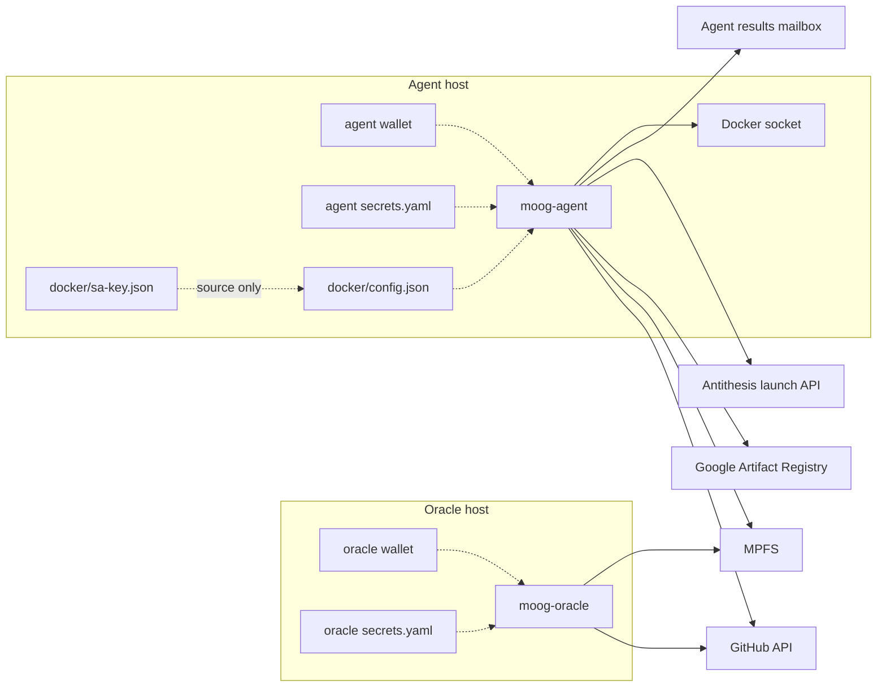

# Agent and oracle config/secrets runbook

This page documents the production-facing configuration layout for the
`moog-agent` and `moog-oracle` services: where configuration lives, which
values are secrets, how Google Artifact Registry auth is represented, how to
rotate values without leaking them, and what to verify after a change.

It intentionally uses placeholders and structural checks. Do not paste real
tokens, wallet mnemonics, app passwords, service-account JSON, or Docker auth
payloads into shell history, tickets, docs, or chat.

## Role split



The oracle owns the on-chain token state. It validates pending requests and
submits state updates. The agent consumes accepted/pending test runs, validates
assets locally with Docker, pushes the Antithesis config image, launches the
run, and later reports the outcome.

## Configuration precedence

Both services use `opt-env-conf`:

1. CLI flags win.
2. Environment variables are next.
3. YAML keys in the file pointed at by `MOOG_SECRETS_FILE` are the fallback.

For production, keep tenant-specific values in `secrets.yaml` whenever
possible and keep the compose file mostly stable. `MOOG_SECRETS_FILE` and
`DOCKER_CONFIG` are bootstrap paths and must remain in the compose
environment.

## Live file layout

The repository deployment examples use a stable symlink:

```text
/secrets/moog-agent/
├── current -> new/
├── old/
│   ├── agent.json
│   ├── secrets.yaml
│   └── docker/
│       └── config.json
└── new/
    ├── agent.json
    ├── secrets.yaml
    └── docker/
        ├── config.json
        └── sa-key.json
```

Some deployed hosts mount `/secrets/moog-agent/new/...` directly instead of
`current/...`. In that case the active directory is whatever the live compose
file references. Always inspect the compose file before assuming which side is
active:

```bash
ssh agent 'sudo sed -n "/secrets:/,$p" /opt/hal/infrastructure/moog/agent/docker-compose.yaml'
```

The oracle host normally has a smaller layout:

```text
/home/paolino/secrets/moog/oracle/
├── oracle.json
└── secrets.yaml
```

The live compose files are on the hosts, not in a local checkout:

| Role | Live compose path |
|---|---|
| Agent | `agent:/opt/hal/infrastructure/moog/agent/docker-compose.yaml` |
| Oracle | `oracle:/opt/hal/infrastructure/moog/oracle/docker-compose.yaml` |

Edit the live compose file only when the mount paths, image tag, command, or
bootstrap env vars must change. Most rotations only update files under
`/secrets/...` and then recreate the container.

## Agent files

### `agent.json`

`agent.json` is the agent wallet file. It must correspond to the wallet funded
for the agent role. Never inspect it with `cat`, `head`, `tail`, or by pasting
the file into another tool. Use the CLI metadata view:

```bash
ssh agent 'sudo moog wallet info -w /secrets/moog-agent/new/agent.json'
```

If the compose file mounts the wallet into the container as
`/run/secrets/agent-wallet`, `secrets.yaml` should set:

```yaml
walletFile: /run/secrets/agent-wallet
```

### `secrets.yaml`

A typical agent `secrets.yaml` shape:

```yaml
# Runtime settings
tokenId: <moog-token-asset-id>
mpfsHost: https://mpfs.plutimus.com
walletFile: /run/secrets/agent-wallet
wait: 240
mpfsTimeoutSeconds: 120
pollIntervalSeconds: 60
minutes: 1440
registry: us-central1-docker.pkg.dev/<project>/<repository>
antithesisUser: <tenant-user>
antithesisLaunchUrl: https://<tenant>.antithesis.com/api/v1/launch/<launcher>

# Secrets
githubPAT: <github-pat>
walletPassphrase: <wallet-passphrase-if-encrypted>
antithesisPassword: <antithesis-password>
agentEmail: <mailbox-address>
agentEmailPassword: <mailbox-app-password>
slackWebhook: <optional-webhook>
trustedRequesters:
  - <github-username>
```

Current amaru deployment values should point at the amaru tenant, for example:

```yaml
antithesisUser: pragma
antithesisLaunchUrl: https://amaru-cardano.antithesis.com/api/v1/launch/amaru-cardano
```

Use the release binary for operational requests against the live service.
Developer builds can diverge in wire encodings and have previously produced
requests the oracle could not validate.

### `docker/sa-key.json`

`sa-key.json` is the raw Google Cloud service-account JSON. It is a source file
used to regenerate Docker auth. It is not the file Docker reads at runtime.

Do not mount `sa-key.json` as `DOCKER_CONFIG`, do not paste it into command
arguments, and do not log it. It should be readable only by root/operators.

### `docker/config.json`

`config.json` is the Docker auth wrapper used by `docker push`. For Google
Artifact Registry it must have this shape:

```json
{
  "auths": {
    "us-central1-docker.pkg.dev": {
      "auth": "<base64 of _json_key:<raw-service-account-json>>"
    }
  }
}
```

The `auth` value is secret. The only safe checks are structural checks and
length/presence checks:

```bash
ssh agent "sudo jq -e '.auths[\"us-central1-docker.pkg.dev\"].auth | length > 100' /secrets/moog-agent/new/docker/config.json >/dev/null && echo 'docker config looks populated'"
```

Regenerate it from `sa-key.json` on the agent host without printing the raw key:

```bash
ssh agent 'sudo bash -s' <<'REMOTE'
set -euo pipefail
install -d -m 0700 /secrets/moog-agent/new/docker
auth="$(printf '%s' "_json_key:$(cat /secrets/moog-agent/new/docker/sa-key.json)" | base64 -w0)"
umask 077
printf '{"auths":{"us-central1-docker.pkg.dev":{"auth":"%s"}}}\n' "$auth" \
  > /secrets/moog-agent/new/docker/config.json
unset auth
REMOTE
```

The generated `config.json` is what the compose file should mount at
`/run/secrets/docker/config.json`, with `DOCKER_CONFIG=/run/secrets/docker`.

## Oracle files

### `oracle.json`

`oracle.json` is the oracle wallet file. The token owner is bound when the
token is minted (the `moog oracle token boot` command that did this was
removed from the CLI in v0.5.1.3), so a live oracle wallet cannot be
rotated for an existing token unless the on-chain token state is recreated.

Check wallet metadata without printing the wallet:

```bash
ssh oracle 'moog wallet info -w /home/paolino/secrets/moog/oracle/oracle.json'
```

Check that the token owner and wallet owner match:

```bash
ssh oracle 'moog token --no-pretty | jq -r .state.owner'
ssh oracle 'moog wallet info -w /home/paolino/secrets/moog/oracle/oracle.json | jq -r .owner'
```

Those two values must be identical. If they are not, recreating/restarting the
oracle container will not fix the token.

### `secrets.yaml`

A typical oracle `secrets.yaml` is intentionally small:

```yaml
githubPAT: <github-pat>
walletPassphrase: <wallet-passphrase-if-encrypted>
tokenId: <moog-token-asset-id>
mpfsHost: https://mpfs.plutimus.com
walletFile: /run/secrets/oracle-wallet
wait: 240
mpfsTimeoutSeconds: 120
pollIntervalSeconds: 30
```

The oracle GitHub PAT validates users, repositories, CODEOWNERS, and source
assets. Keep it separate from the agent PAT when possible so the services do
not share one GitHub rate-limit bucket.

## Compose refresh rule

Docker Compose materializes `secrets:` into the container at create time. After
changing any mounted secret file, a plain restart is not sufficient:

```bash
docker compose restart moog-agent      # not enough after secret-file changes
docker restart agent-moog-agent-1      # not enough after secret-file changes
```

Recreate the service instead:

```bash
cd /opt/hal/infrastructure/moog/agent
sudo docker compose up -d --force-recreate moog-agent
```

For the oracle:

```bash
cd /opt/hal/infrastructure/moog/oracle
sudo docker compose up -d --force-recreate moog-oracle
```

If the compose service names differ, use `docker compose config --services` in
the live compose directory and recreate the listed service.

## Rotation playbooks

### Rotate the agent GitHub PAT

Write the new value through stdin so it does not appear in shell history:

```bash
ssh agent 'read -rs NEW_PAT; export NEW_PAT; \
  sudo -E yq -i ".githubPAT = strenv(NEW_PAT)" /secrets/moog-agent/new/secrets.yaml; \
  unset NEW_PAT' < /path/to/new-agent-github-pat
```

Then recreate the agent container:

```bash
ssh agent 'cd /opt/hal/infrastructure/moog/agent && sudo docker compose up -d --force-recreate moog-agent'
```

### Rotate the oracle GitHub PAT

```bash
ssh oracle 'read -rs NEW_PAT; export NEW_PAT; \
  sudo -E yq -i ".githubPAT = strenv(NEW_PAT)" /home/paolino/secrets/moog/oracle/secrets.yaml; \
  unset NEW_PAT' < /path/to/new-oracle-github-pat
ssh oracle 'cd /opt/hal/infrastructure/moog/oracle && sudo docker compose up -d --force-recreate moog-oracle'
```

If `yq` is not installed, or if sudo is configured to drop the exported
environment, edit the file with a root editor on the host or use a temporary
file with `install -m 0600`. Do not use `sed` commands that place the token in
the command line.

### Rotate the Antithesis password

Update `antithesisPassword` in the agent `secrets.yaml` through stdin, then
recreate the agent. Verify with a launch/API check or by following the agent log
through a new test request; do not print the password.

### Rotate GAR credentials

1. Put the new raw service account at
   `/secrets/moog-agent/new/docker/sa-key.json` with mode `0600`.
2. Regenerate `/secrets/moog-agent/new/docker/config.json` from the raw key.
3. Run the structural `jq` check above.
4. Recreate the agent container.
5. Submit or replay a small test run and confirm the logs reach the Docker push
   step without `denied`, `Unauthenticated`, or `authentication failed`.

### Rotate the agent wallet

1. Create or install the new wallet as the inactive `agent.json`.
2. Fund it with enough ADA for state-update transactions.
3. Verify metadata with `moog wallet info -w`.
4. If using the `current` symlink pattern, flip `current` to the new directory.
5. Recreate the agent container.

The agent wallet is operationally rotatable because the agent signs its own
state transitions. The oracle wallet is not rotatable for an already-booted
token because `state.owner` is fixed on-chain.

## Verification checklist

### Container state

```bash
ssh agent 'cd /opt/hal/infrastructure/moog/agent && sudo docker compose ps'
ssh oracle 'cd /opt/hal/infrastructure/moog/oracle && sudo docker compose ps'
```

Expected service containers in the current deployment are typically:

| Host | Container |
|---|---|
| Agent | `agent-moog-agent-1` |
| Agent | `agent-email-dump-1` |
| Oracle | `oracle-moog-oracle-1` |

### Config mounted into the agent

Check paths and presence, not values:

```bash
ssh agent "sudo docker exec agent-moog-agent-1 sh -lc '
  test \"\$DOCKER_CONFIG\" = /run/secrets/docker &&
  test -s /run/secrets/secrets &&
  test -s /run/secrets/agent-wallet &&
  test -s /run/secrets/docker/config.json &&
  echo \"agent secret mounts are present\"
'"
```

### Logs

Agent signals:

```bash
ssh agent 'sudo docker logs --tail 200 agent-moog-agent-1 | grep -Ei "pending|download|docker|push|antithesis|accept|report|error|fail"'
```

Oracle signals:

```bash
ssh oracle 'sudo docker logs --tail 200 oracle-moog-oracle-1 | grep -Ei "pending|validate|submit|accepted|reject|error|fail"'
```

Email result collection:

```bash
ssh agent 'sudo docker logs --tail 200 agent-email-dump-1'
```

### Chain state

From a machine with the operational `moog` binary and the right
`MOOG_TOKEN_ID`/`MOOG_MPFS_HOST`:

```bash
moog facts test-runs pending --pretty
moog facts test-runs running --pretty
moog facts test-runs accepted --pretty
```

### Antithesis run visibility

Use the tenant API/proxy tooling rather than browser-only checks:

```bash
moog antithesis runs --limit 5
```

If you are using the separate Antithesis REST CLI, `anti runs` should show the
same recently launched run.

## Failure matrix

| Symptom | Likely cause | Check | Fix |
|---|---|---|---|
| Agent logs show GAR `denied`, `Unauthenticated`, or `authentication failed` | `docker/config.json` is missing, stale, or not the Docker auth wrapper | Structural `jq` check on `config.json`; inspect `DOCKER_CONFIG` path inside container | Regenerate `config.json` from `sa-key.json`; recreate agent |
| Agent logs show Antithesis `403` | Wrong tenant launch URL or user | Check `antithesisUser` and `antithesisLaunchUrl` in `secrets.yaml` without printing passwords | Set the tenant-specific values; recreate agent |
| Request validation reports source-dir absent after asset download | Expired/invalid GitHub PAT can surface as a misleading asset/source validation failure | Check GitHub API status with the PAT without printing it | Rotate the relevant PAT; recreate service |
| Oracle crash-loops around malformed request or state update | Stuck request or incompatible request encoding | Inspect pending requests and recent oracle logs | Retract bad requests or use the release `moog` binary for requester submissions |
| Test run remains `running` after Antithesis completed | Completion email was not collected or result reporting failed | Check `agent-email-dump-1`, agent logs, and `running` facts | Run/let the agent run `collect-all-results`; report unknown if necessary |
| Secret rotation appears to have no effect | Container was restarted but not recreated | Compare container create time; inspect mounted secret presence | `docker compose up -d --force-recreate <service>` |
| Oracle starts but never updates token | Wallet owner does not match token owner, wrong token id, or bad PAT | Compare `moog token .state.owner` with `moog wallet info .owner`; check PAT status | Restore correct oracle wallet/token id or rotate PAT |

## What not to do

- Do not print wallet JSON, service-account JSON, PATs, Docker auth strings, or
  Antithesis passwords.
- Do not mount `sa-key.json` as `DOCKER_CONFIG`; Docker needs `config.json`.
- Do not assume `docker restart` reloads changed compose secrets.
- Do not edit a local checkout and expect production to change; edit the live
  compose path on the host.
- Do not rotate the oracle wallet on a live token unless you are also
  re-booting/replacing the token.
- Do not use a development `moog` binary for operational test requests when a
  release binary is available.
