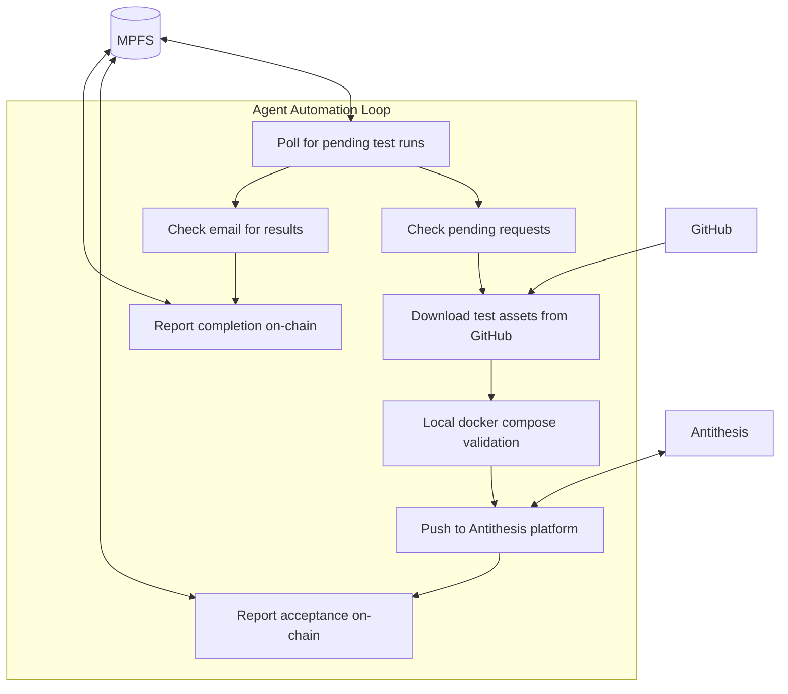

# Agent role manual

## Agent Service Architecture



## Running as Docker Service

The agent can run as an automated Docker service that continuously polls for and processes test runs.

See the [Deployment Guide](deployment.md#agent-deployment) for full setup instructions including secrets, docker-compose configuration, and startup.

### Automation flags

| Flag | Description | Default |
|---|---|---|
| `--poll-interval` | Seconds between polling cycles | 60 |
| `--minutes` | Time window (in minutes) to search for email results | — |
| `--trust-all-requesters` | Accept test runs from any requester (skip trusted list check) | disabled |

!!! note "Deprecated flag"
    The `--days` flag was replaced by `--minutes` in v0.4.1.1. Use `--minutes 1440` instead of `--days 1`.

### Environment variables

| Variable | Description |
|---|---|
| `MOOG_MPFS_HOST` | URL of the MPFS service |
| `MOOG_WALLET_FILE` | Path to the agent wallet JSON file |
| `MOOG_TOKEN_ID` | The moog token asset ID |
| `MOOG_SECRETS_FILE` | Path to `secrets.yaml` |
| `MOOG_WAIT` | Seconds between polling cycles (alternative to `--poll-interval`) |
| `MOOG_ANTITHESIS_USER` | Antithesis platform username |
| `DOCKER_CONFIG` | Path to Docker config directory (for private registries) |

### Docker socket and privileged mode

The agent container requires:

- **Docker socket** (`/var/run/docker.sock`) — the agent runs `docker compose up --build` to validate test assets locally before pushing them to Antithesis.
- **Privileged mode** — required for Docker-in-Docker operations.

See [Security](security.md#docker-security) for the security implications of this setup.

## White-list repositories

In the interest of avoiding spam the agent has to white-list repositories before the oracle will accept test-runs for them.

Two commands are available

### White-list a repository

```asciinema-player
{ "file": "assets/video/whitelist-repo.cast"
, "mkap_theme": "none"
, "cols": 100
}
```

This will only work if the repository is not already white-listed and the repository is in GitHub.
```bash
moog agent white-list <platform> <repository>
```

ATM only GitHub is supported as a platform.
The format of the repository is `<owner>/<repository>`, e.g. `cardano-foundation/moog`.

### Black-list a repository

```asciinema-player
{ "file": "assets/video/blacklist-repo.cast"
, "mkap_theme": "none"
, "cols": 100
}
```

This will only work if the repository is white-listed.
```bash
moog agent black-list <platform> <repository>
```

## Query pending test-runs

The agent is responsible for managing test-runs from pending to running and completed.

```bash
moog facts test-runs pending --pretty
```
will report all the pending test runs in a human friendly format.

## Download a test-run assets

Once a test-run is pending the agent can download the assets for the test-run.

```bash
moog agent download-assets -i <test-run-id> -D <directory>
```

This will download the assets for the test-run with id `<test-run-id>` into the directory `<directory>`.

## Start a test-run locally

At the moment there is no moog-cli command to start a test-run locally. But a minimal check could be done via docker compose.

```bash
cd <directory>
INTERNAL_NETWORK=true docker compose up --build
```

Obviously you should do all kind of analysis you deem necessary on the assets before deciding the next step.

## Reject a test-run

If the agent decides a test-run is not acceptable it can reject it.

```bash
moog agent reject-test -i <test-run-id> --reason <reason>
```

## Push a test-run to antithesis platform

Once decided a test-run is acceptable the agent can push the test-run to the antithesis platform.

```bash
moog agent push-test -i <test-run-id> -D <directory>
```

This will push the test-run with id `<test-run-id>` to the antithesis platform

## Report the acceptance of a test-run on-chain

Once a test-run is pushed to the antithesis platform the agent has to report the acceptance of the test-run on-chain.

```bash
moog agent accept-test -i <test-run-id>
```

This will move it from `pending` to `running` state in the facts.

## Check for the completion of a test-run

ATM we can only collect results via email.
The email is passed in the post request when the test-run on the recipients list.


```bash
export MOOG_AGENT_EMAIL="<your-email>"
```

Then you can check for the completion of a test-run via

```bash
moog agent collect-results-for --test-run-id <test-run-id> --minutes <n> --ask-agent-email-password
```

!!! note "HAL Team"
    To use your CF email you have to use an app password. If you use your password you  will get an error like

    `LoginFailed user error (NO: Application-specific password required: https://support.google.com/accounts/answer/185833 (Failure))`

    Just go to https://myaccount.google.com/apppasswords and create an app password.

## Report the completion of a test-run on-chain

Once the result URL is retrieved the agent has to report the completion of the test-run on-chain.

```bash
moog agent report-test -i <test-run-id> --url <result-url>  --duration <duration-in-hours>
```

The URL is encrypted automatically with the requester's public key.
