# Architecture Overview

This document provides an overview of the architecture of the Antithesis CLI tool, which is designed to administer Antithesis tests execution through Cardano.

## Decentralization model

The Antithesis CLI tool operates within a decentralized framework, leveraging blockchain technology to ensure transparency, security, and immutability of test execution records.

First-class participation would imply access to a Cardano node. However, the system is designed to separate blockchain interaction from test execution management, allowing the backend service to run separately, next to the Cardano node.

To improve component reusability, the backend service has no knowledge of project-specific goals and is developed in a separate repository: [MPFS](https://github.com/cardano-foundation/MPFS).

In a perfect setup, each actor should run both the CLI tool and the MPFS service locally. However, for practical reasons, we expect most users to run only the CLI tool while relying on remote shared instances of the MPFS service. [Security considerations](security.md) should be taken into account when choosing between local or shared MPFS service instances.

## Systems

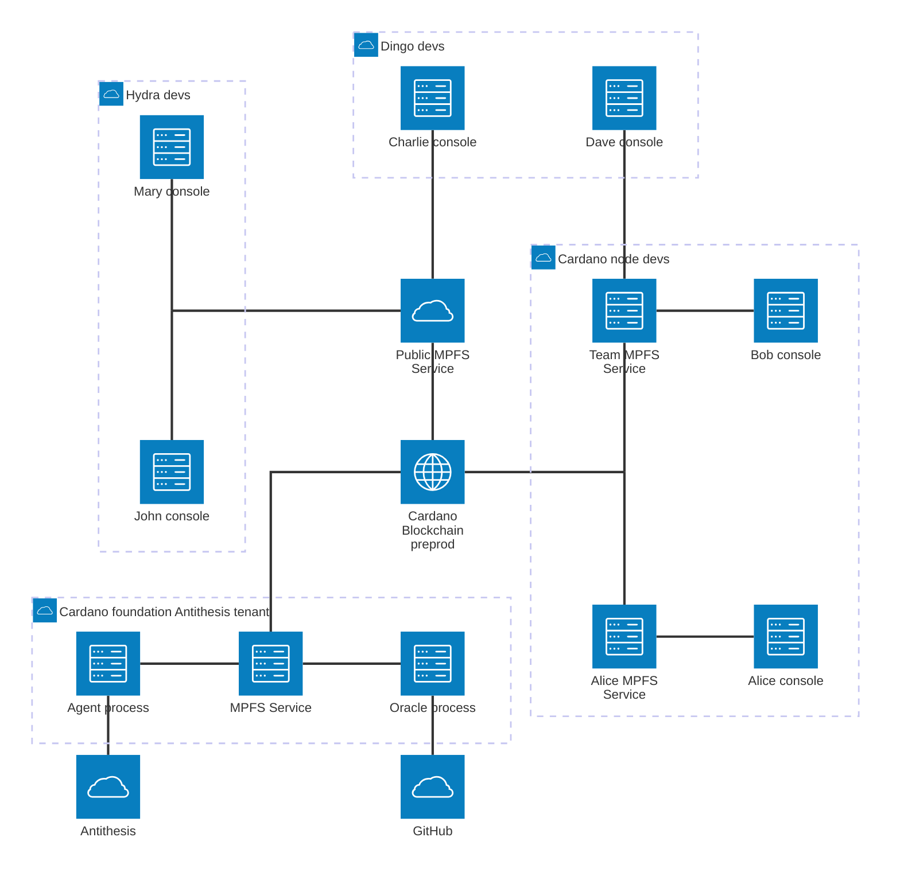
### GitHub Platform

We use GitHub services to manage user identities, roles, and per-repository test assets hosting.

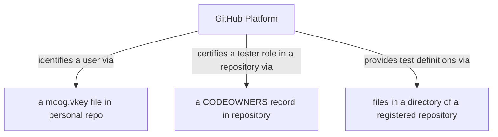

#### GitHub as identity provider

Any GitHub user can register themselves against the system state by deploying a file containing a Cardano public key in their personal GitHub repository.
- GitHub docs: [profile repository](https://docs.github.com/en/account-and-profile/how-tos/profile-customization/managing-your-profile-readme).
- Example: [moog-cli.vkey](https://github.com/cfhal/cfhal/blob/main/moog-cli.vkey).

#### Github as Antithesis role management

To grant the Antithesis tester role, a GitHub repository must explicitly list GitHub users in its CODEOWNERS file; the system uses this mapping to determine which users are authorized as testers for that repository.
- Example: [CODEOWNERS](https://github.com/cardano-foundation/moog/blob/main/CODEOWNERS)

#### Github as test assets hosting

Any GitHub repository that has been registered with the system (i.e., contains a valid user public key and is whitelisted for test execution) can host a directory containing test definitions that meet the required format and standards. Currently only a runnable docker-compose.yaml is required.

- Example: [test definition](https://github.com/cardano-foundation/moog/tree/main/compose/testnets/cardano_node_master)

### Antithesis Platform

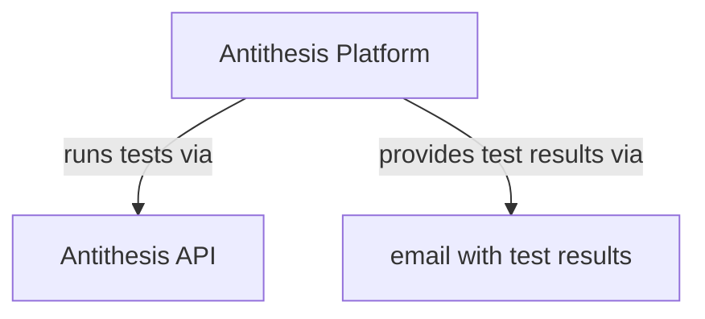
Antithesis is the test execution platform that provides the infrastructure to run tests and collect results. Currently we use a POST API to create test runs and fetch results via email parsing. In the future the platform will provide a better API to manage test runs and fetch results.

- Antithesis docs: [API](https://antithesis.com/docs/webhook/test_webhook/)

### Cardano Blockchain

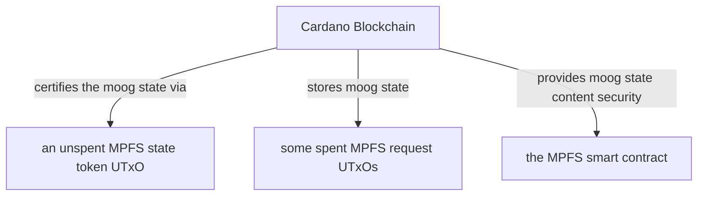

The blockchain will store data and certifications for
- GitHub user and their associated Cardano public keys.
- GitHub roles such as repository testers by Antithesis.
- Repository whitelisting for test execution.
- Oracle validation configuration.
- Record of each test execution requests and (link to their) results.

The cryptographic aspects of the system are defined by the use of an underlying MPFS system as intermediary between the CLI tool and the blockchain.

This choice enforce a strict protocol that ensures

- Any system fact is always certified on-chain (merkle root).
- All and only of the system state transitions have been recorded in the merkle tree have been spent and validated on-chain.

### MPFS Service instances.

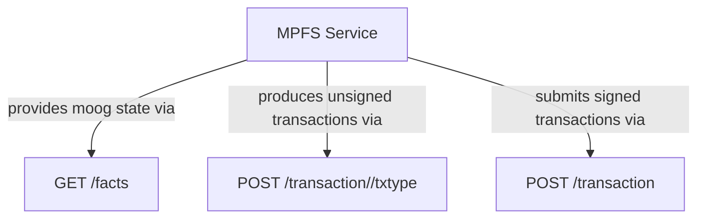

The MPFS Service is a backend system that all actors will use to interact with the blockchain in a way independent from the application logic.

It exposes a REST API to be used by the CLI tool.

The system is capable of producing unsigned transactions for the system users, submitting signed transactions to the blockchain, and most importantly providing the current system state, cryptographically certified and stored on-chain.

We borrow many concepts and much terminology from the MPFS project. In particular the system state is referred to as **facts**.

### Moog CLI Tool (and automations)

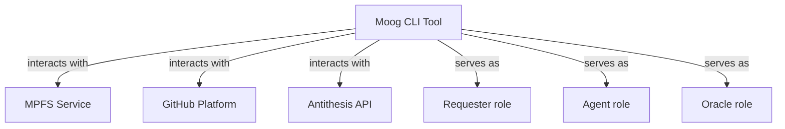
This is the command line interface that users will use to interact with the MPFS service and GitHub and manage their test executions on Antithesis.
With it users can:
- Browse the system state querying the MPFS service for facts (as any role).
- Issue and validate requests to update the system state via Cardano transactions (as requester or agent).
- Interact with GitHub to validate requests against the system state (as requester or agent).
- Interact with Antithesis API to create test runs and collect results (as agent).

## Roles

The CLI tool, along with its built-in automation features for test execution and state management, supports the following roles: requester, agent, and oracle.

### Requester role

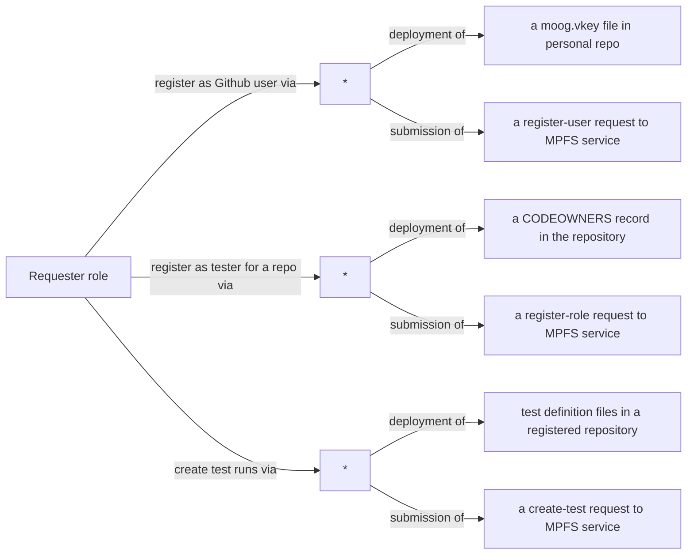

A GitHub user who initiates test execution requests on the Antithesis platform.

The `requester` role involves no automation; users interact exclusively through the CLI tool to act as a requester.

They use the CLI tool to submit administrative requests (such as user and role registration) and test requests (such as creating test runs), interacting with the MPFS service and GitHub to validate their actions against the current system state.

The `requester` role is fully manual, requiring users to perform all actions through the CLI tool without automation.

### Agent role

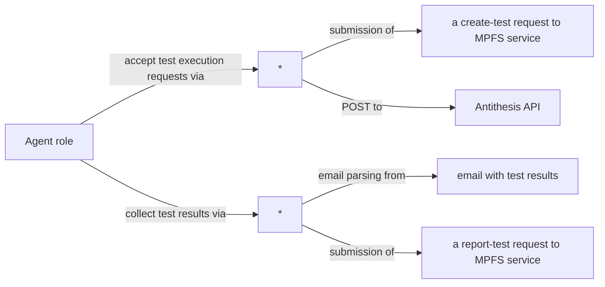

A user who interacts with both the Antithesis API and the MPFS service, responsible for automating the execution of tests on the Antithesis platform and collecting results, while also managing relevant state changes and validations.

The `agent` role is partially automated and so an executable and docker image is provided to run it as a service; however, the agent must manually `whitelist` repositories using the CLI tool before the oracle can validate test execution requests from those repositories.

### Oracle role

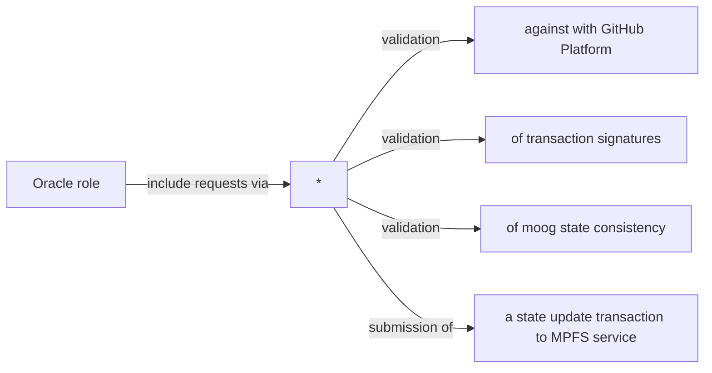
A trusted user that manages and maintains authority over the system state, validates requests from the other roles, and updates the state of the system on the blockchain.
The `oracle` role is fully automated; an executable and Docker image are provided to run it as a service.

## MPFS derived concepts

The use of MPFS imposes a strict protocol and terminology to describe the interactions between the different roles.

### State token

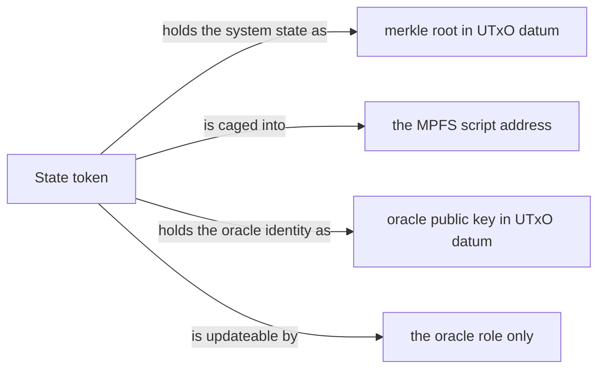

The MPFS is a multi-project token centric system, meaning that each project's state and identity are managed through unique tokens on the Cardano blockchain.

Each project is represented by a unique asset, but they all share the same MPFS policy id. The policy id imposes a minting policy that ensures the merkle tree is empty at the beginning of time and that the asset is unique on the blockchain.

The MPFS policy id is also the script address where each project token is caged into. The script is responsible for enforcing the MPFS protocol on all MPFS tokens.

Each state token holds the system state as a `merkle root` in a UTxO datum. The smart contract script enforces that any state transition must consume the current state token and produce a new state token with an updated merkle root and put it back at the same script address.

Only the `oracle` role is allowed to update (consume) the state token and put back a new version of it with an updated state.

### State change requests

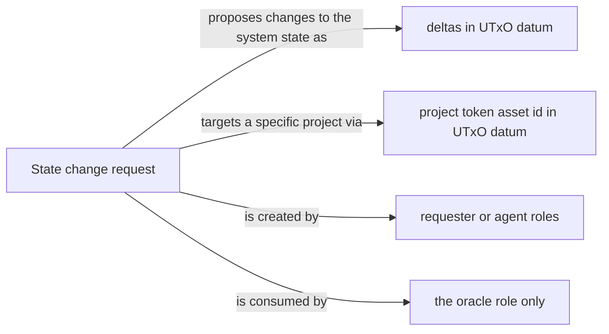
`requester` and `agent` roles are both seen as users from the MPFS perspective. They interact with the system by issuing state change requests.

State change requests appears on chain as UTxO datums locked at the MPFS script address.
They contain proposed changes in the form of deltas to be applied to the current system state.
They also contain the asset id of the project token they are targeting.

The smart contract script enforces that they are only consumed by the `oracle` role when updating the system state.

A broad classification of change requests for our project is:
- Requester role:
  - Administrative requests: used to register users and roles (a.k.a. repositories)
  - Test requests: used to create test runs
- Agent role:
  - Administrative requests: used to whitelist repositories
  - Test requests: used to accept/reject test runs and update test results
- Oracle role:
  - The oracle role exceptionally behave as a user when it publishes its own configuration on-chain.

### State updates

The `oracle` role as seen from the MPFS perspective is the guardian of the system state.

As an MPFS oracle it is responsible for
- Creating the project token in the MPFS
- Updating the token state based on the change requests issued by the other roles.

As the guardian of the state it has the responsibility to validate the change requests and prevent inconsistent data to enter/exit the token.
Typical validations on requests performed by the oracle are:
- Validating GitHub credentials and roles. This is really post-oracle-ing GitHub.
- Validating digital signatures on requests. Only registered users are allowed to start new tests.
- Validating repository whitelisting for test execution. Only tests for whitelisted repositories are allowed.
- Validating the identity of the `agent` role when it comes to modify the tests state.
- Validating the test parameters (e.g. platform, repository, commit, etc.) at test creation time.
- Validating the tests state transitions respect semantic consistency. Every test state is modelled as a finite state machine and the oracle ensures that only valid transitions are allowed.
