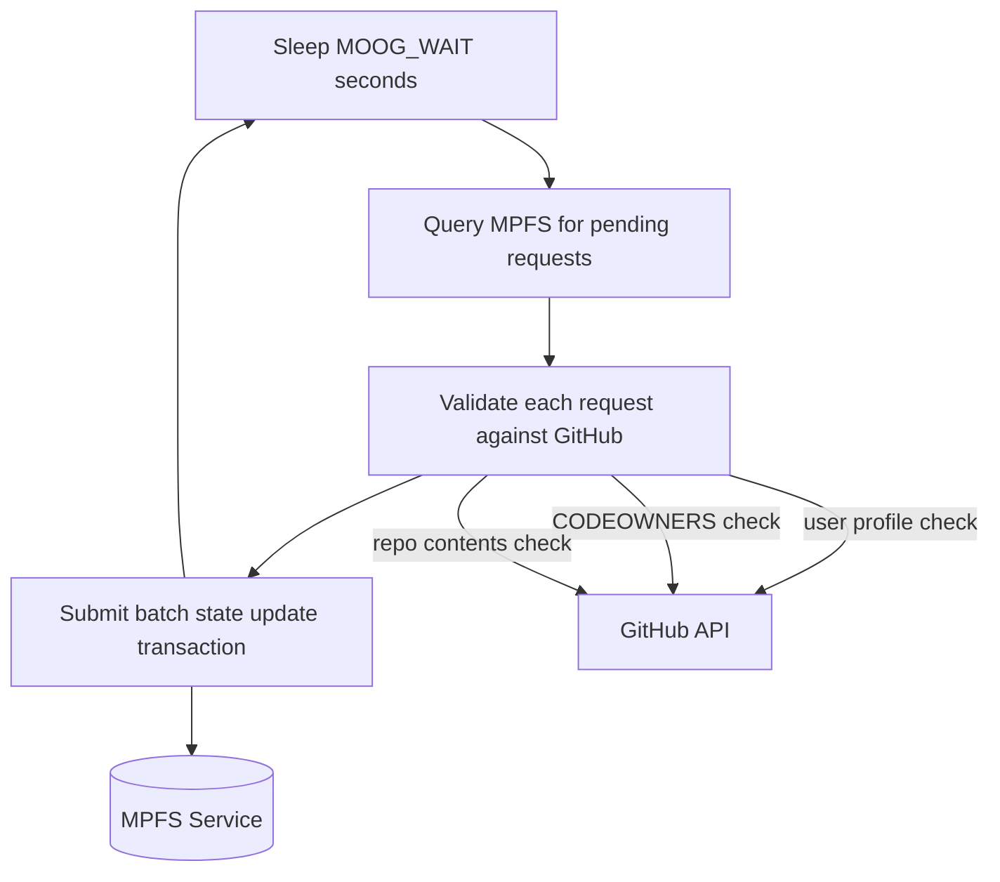

# Oracle role manual

This is the role of the user that wants to run a service to control access to the Antithesis platform. There will be only one token and so there will be only one oracle service running at a time, but we document it here for completeness.

## Oracle Processing Loop



## Running the oracle service

You can build an executable that will continuously check for pending requests and include them in the Antithesis token.

### Build

You can build the oracle service via nix:

```bash
nix build .#moog-oracle
```

On a linux machine you can build a docker container

```bash
nix build .#moog-oracle-docker-image
docker load < result
```

Then you can run the docker container

```bash
version=$(nix eval .#version --raw)
docker run ghcr.io/cardano-foundation/moog/moog-oracle:$version
```

### Running as Docker Service

For production deployment, use Docker Compose. See the [Deployment Guide](deployment.md#oracle-deployment) for full setup instructions including secrets, docker-compose configuration, and startup verification.

## Running oracle commands manually

Alternatively, oracle commands can be run manually, using the `moog` CLI. See the [Installation instructions](../user/installation.md) for how to install it.

## Creating the moog token (only once)

Oracle operations need a wallet. Since the oracle role is critical, in addition to setting the `MOOG_WALLET_FILE` environment variable to point to the wallet file, you should also set the `MOOG_WALLET_PASSPHRASE` environment variable to encrypt the wallet.

You can create a wallet with the `moog wallet create` command.

```bash
moog wallet create
```

You can check the wallet info with:

```bash
moog wallet info
```

Example output:

```json
{
  "address": "addr_test1...",
  "filePath": "tmp/oracle.json",
  "owner": "1f5cebecb4cd1cad6108a86014de9d8f23f9d4477bbddb3e1289b224"
}
```

To create the Antithesis token, you can use the `moog oracle token create` command.

```bash
moog oracle token boot
```

It will create the Antithesis token. This token is a unique identifier for the Antithesis platform and will be used by all users to interact with the platform. You have to distribute it so that users can set the `MOOG_TOKEN_ID` environment variable to point to it.

You can review the token info anytime with

```bash
moog token | jq .state
```

Critically the owner matches the wallet owner.

## Updating the moog token

The main responsibility of the oracle is to include change requests in the Antithesis token.

Pending change requests can be queried with the `moog token` command.

```bash
moog token | jq '.requests'
```

In the requests field you will notice the `validation` field, which will be set to `validated` for all requests that have been validated .

Once you decided what to include in the Antithesis token, you can commit the requests to the token.

Updating the token with new requests is done with the `moog oracle token update` command. As with retract you have to provide the `outputRefId` of the request you want to update. Multiple requests can be updated at once, so you can provide multiple `-o` options.

```bash
moog oracle token update -o b6fc7cca5bcae74e6a5983f7922d0e0985285f1f19e62ccc9cb9fd4d3766a81b-0
```

## Deleting the moog token (DANGEROUS)

To delete the Antithesis token, you can use the `moog oracle token delete` command.

```bash
moog oracle token delete
```

## Publishing the oracle configuration

Before requesters can request test-runs, the oracle should select the agent identity and in general expose validation parameters so that the requesters and the agent can pre-validate their requests.

This is done with the `moog oracle config set` command.


```bash
moog oracle config set  --min-test-duration MIN_TEST_HOURS --max-test-duration MAX_TEST_HOURS --agent-pkh PUBLIC_KEY_HASH
```

In this situation the oracle is acting like a user and so this request will end up in the Antithesis token as a request for change.

*Apply the token update command to commit the request to the Antithesis token*

This will end up in a fact and so anyone can inspect it with the `moog facts` command.

```bash
moog facts config
```
