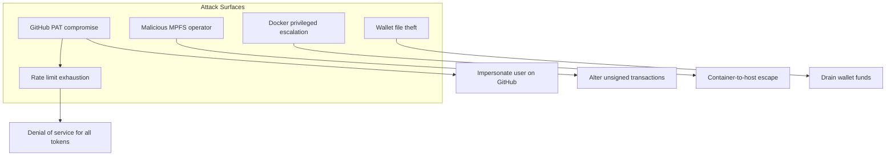

# Security Considerations

## Threat Model



## Remote MPFS Service

The MPFS service is not able to sign transactions for the user. Nevertheless the current implementation doesn't perform any intent-check on the unsigned transactions it receives. Therefore, when using a remote MPFS service, users should ensure that they trust the operator of the service, as a malicious operator could potentially alter the unsigned transactions before sending them back to the user.

To improve the situation [an issue is open in GitHub](https://github.com/cardano-foundation/moog/issues).

## PAT Management

GitHub Personal Access Tokens are used by the oracle and agent to validate requests against GitHub (checking user profiles, CODEOWNERS, downloading assets).

### Scope requirements

PATs should be created with the minimum required scope:

- **`repo`** — access to repository contents, CODEOWNERS files, and user profile repos

### Rotation

PATs expire. An expired PAT causes silent failures — the service continues polling but all GitHub validation fails, burning rate limit requests on 401 responses.

- Set PAT expiry to **90 days** and create a calendar reminder 1 week before
- To rotate: update `githubPAT` in `secrets.yaml` and restart the service
- See [Troubleshooting](troubleshooting.md#pat-expired-or-rate-limited) for diagnosis

### Shared rate limits

GitHub API rate limits (5,000 requests/hour) are **per-user**, not per-token. All PATs belonging to the same GitHub user share one budget. If oracle and agent both use PATs from the same GitHub user, they compete for the same 5,000 requests.

**Recommendation:** Use PATs from different GitHub users for oracle and agent services.

## Docker Security

The agent container runs with **privileged mode** and mounts the **Docker socket** from the host. This is required because the agent validates test assets by running `docker compose up --build` locally before pushing to Antithesis.

### Implications

- **Container-to-host escape:** A compromised agent container with privileged mode and Docker socket access has effective root access to the host machine.
- **Image pull/push:** The agent has Docker registry credentials (via `DOCKER_CONFIG`) that could be used to access private registries.

### Mitigations

- Run the agent on a dedicated machine or VM, not on shared infrastructure
- Use read-only mounts where possible (CA certs are already mounted `:ro`)
- Monitor Docker socket usage through host-level auditing
- Restrict network access from the agent machine to only required endpoints

## Wallet Security

Oracle and agent wallets hold ADA needed for submitting Cardano transactions. They should contain only the minimum balance needed for operations.

### Passphrase protection

Wallets can be encrypted with a passphrase. When encrypted, provide the passphrase via `secrets.yaml`:

```yaml
walletPassphrase: your_passphrase
```

### File permissions

Wallet files and `secrets.yaml` should have restricted permissions:

```bash
chmod 600 /secrets/moog-oracle/oracle.json
chmod 600 /secrets/moog-oracle/secrets.yaml
chmod 600 /secrets/moog-agent/agent.json
chmod 600 /secrets/moog-agent/secrets.yaml
```

In Docker Compose, these are mounted as Docker secrets (under `/run/secrets/`), which provides isolation from the container filesystem.
