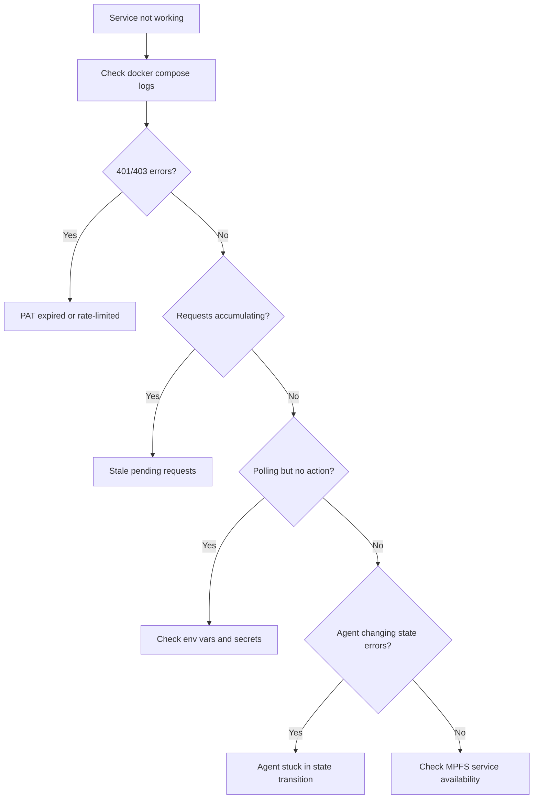

# Troubleshooting

Common issues and how to resolve them.

## Diagnostic Flowchart



## PAT Expired or Rate-Limited

### Symptoms

- **401 Unauthorized** or **403 Forbidden** errors in logs
- Oracle validates no requests despite pending ones existing
- Agent fails to download test assets
- Rate limit header shows `remaining: 0`

### Diagnosis

Check the PAT validity and rate limit status:

```bash
# Check rate limit (replace <PAT> with your token)
curl -s -H "Authorization: token <PAT>" \
  https://api.github.com/rate_limit | jq '.rate'
```

Expected output:
```json
{
  "limit": 5000,
  "remaining": 4832,
  "reset": 1708300000,
  "used": 168
}
```

If `remaining` is 0 or the request returns 401, the PAT is expired or rate-limited.

### Fix

1. **If expired:** Create a new PAT at [github.com/settings/tokens](https://github.com/settings/tokens) with `repo` scope
2. Update `secrets.yaml`:
   ```yaml
   githubPAT: ghp_new_token_here
   ```
3. Restart the service:
   ```bash
   docker compose restart
   ```

!!! warning "Rate limit is per-user, not per-token"
    If oracle and agent use PATs from the same GitHub user, they share the 5,000 requests/hour budget. Consider using PATs from different GitHub users for oracle and agent.

## Stale Pending Requests

### Symptoms

- Multiple pending requests visible in `moog facts test-runs pending`
- Requests have been pending for longer than expected (hours/days)
- Oracle logs show it is polling but not processing requests

### Diagnosis

Check how many requests are pending:

```bash
moog facts test-runs pending --pretty
```

Check oracle logs for validation errors:

```bash
docker compose logs --tail 100 | grep -i "error\|fail\|reject"
```

### Fix

If the oracle is down or the PAT was expired for an extended period, requests may have accumulated. There are two approaches:

**Option 1: Fix the oracle and let it catch up**

Once the oracle is running with a valid PAT, it will process all pending requests in subsequent polling cycles.

**Option 2: Retract stale requests**

If requests are no longer relevant, the requester can retract them:

```bash
moog retract -o <output-ref-id>
```

The `output-ref-id` can be found in the pending requests output.

## Oracle Polling Failures

### Symptoms

- Oracle container is running but logs show repeated errors
- No state updates happening on-chain
- Pending requests keep accumulating

### Diagnosis

```bash
# Check oracle is running
docker compose ps

# Check recent logs
docker compose logs --tail 50 moog-oracle

# Verify MPFS is reachable
curl -s https://mpfs.plutimus.com/health
```

### Common causes

| Cause | Log indicator | Fix |
|---|---|---|
| MPFS unreachable | Connection refused / timeout | Check MPFS service, check `MOOG_MPFS_HOST` |
| Invalid wallet | Wallet decode error | Verify `MOOG_WALLET_FILE` path and file contents |
| Wrong token ID | Token not found | Verify `MOOG_TOKEN_ID` matches the deployed token |
| Expired PAT | 401/403 from GitHub | Rotate PAT in `secrets.yaml`, restart |
| Insufficient funds | Balance too low | Send ADA to the oracle wallet address |

## Agent Stuck in State Transition

### Symptoms

- Agent logs show errors when trying to accept or report a test
- Test stuck in `pending` or `running` state
- Transaction submission failures

### Diagnosis

```bash
# Check agent logs
docker compose logs --tail 100 moog-agent

# Check current test run states
moog facts test-runs pending --pretty
moog facts test-runs running --pretty
```

### Common causes

- **Insufficient funds** in agent wallet — send ADA to the agent wallet address
- **MPFS transaction conflicts** — another transaction was submitted concurrently; the agent will retry on next poll
- **Antithesis API errors** — check if Antithesis platform is reachable and credentials are valid

## Rate Limit Monitoring

### Check current rate limit

```bash
curl -s -H "Authorization: token <PAT>" \
  https://api.github.com/rate_limit | jq '{
    limit: .rate.limit,
    remaining: .rate.remaining,
    used: .rate.used,
    resets_at: (.rate.reset | todate)
  }'
```

### Estimate consumption

Each oracle polling cycle makes approximately:

- 1 request to check pending requests
- N requests for GitHub validation (per pending request: user profile, CODEOWNERS, repo contents)

Each agent polling cycle makes approximately:

- 1 request to check pending test runs
- 2-3 requests per test run to download assets

With a 60-second poll interval and 10 pending requests, the agent alone could use ~1,800 requests/hour.

!!! tip "Reduce rate limit usage"
    Increase `--poll-interval` or `MOOG_WAIT` to reduce API call frequency when rate limits are a concern.
