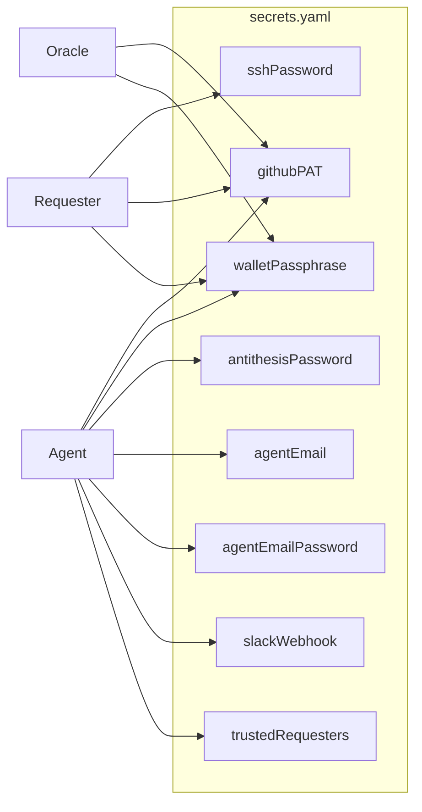

# Secrets management tips

## Secrets in docker containers

When passing secrets to a docker container in a compose you can use the `MOOG_SECRETS_FILE` environment variable to point to a file containing the secrets in yaml format. So instead of setting say `MOOG_SSH_PASSWORD` and `MOOG_GITHUB_PAT` you can create a file `secrets.yaml` with the following content:

```yaml
sshPassword: your_ssh_password
githubPAT: your_github_pat
```

and then pass it to the container with something like:

```yaml
services:
  moog:
    .....
    environment:
      - MOOG_SECRETS_FILE=/run/secrets/anti_secrets
    secrets:
      - anti_secrets

secrets:
  anti_secrets:
    file: ./secrets.yaml
```

## Secrets by Role



Each role uses a different subset of the secrets. Below is the complete `secrets.yaml` structure for each role.

### Oracle secrets.yaml

```yaml
githubPAT: ghp_xxxxxxxxxxxx        # GitHub PAT with repo scope
walletPassphrase: your_passphrase   # wallet encryption passphrase (if any)
```

### Agent secrets.yaml

```yaml
agentEmail: agent@example.com             # email for receiving Antithesis results
agentEmailPassword: xxxx-xxxx-xxxx-xxxx   # app password for the email account
githubPAT: ghp_xxxxxxxxxxxx              # GitHub PAT with repo scope
antithesisPassword: your_password         # Antithesis registry/platform password
walletPassphrase: your_passphrase         # wallet encryption passphrase (if any)
slackWebhook: https://hooks.slack.com/... # Slack notifications (optional)
trustedRequesters:                        # allowed requester PKHs (optional)
  - pkh_1
  - pkh_2
```

### Requester secrets.yaml

```yaml
sshPassword: your_ssh_password      # SSH password for Git operations
githubPAT: ghp_xxxxxxxxxxxx        # GitHub PAT with repo scope
walletPassphrase: your_passphrase   # wallet encryption passphrase (if any)
```

### All supported keys

| Key | Used by | Description |
|---|---|---|
| `sshPassword` | requester | SSH password for Git operations |
| `githubPAT` | oracle, agent, requester | GitHub Personal Access Token |
| `walletPassphrase` | oracle, agent, requester | Wallet encryption passphrase |
| `antithesisPassword` | agent | Antithesis platform/registry password |
| `agentEmail` | agent | Email address for receiving test results |
| `agentEmailPassword` | agent | App password for the email account |
| `slackWebhook` | agent | Slack webhook URL for notifications |
| `trustedRequesters` | agent | List of trusted requester public key hashes |