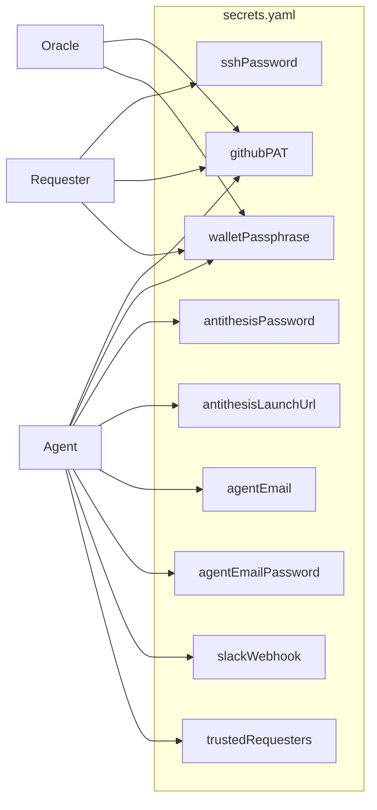

# Secrets management tips

## Secrets in docker containers

When passing secrets to a docker container in a compose you can use the `MOOG_SECRETS_FILE` environment variable to point to a file containing the secrets in yaml format. So instead of setting say `MOOG_SSH_PASSWORD` and `MOOG_GITHUB_PAT` you can create a file `secrets.yaml` with the following content:

```yaml
sshPassword: your_ssh_password
githubPAT: your_github_pat
```

and then pass it to the container with something like:

```yaml
services:
  moog:
    .....
    environment:
      - MOOG_SECRETS_FILE=/run/secrets/anti_secrets
    secrets:
      - anti_secrets

secrets:
  anti_secrets:
    file: ./secrets.yaml
```

## Configuration precedence

`moog-agent` and `moog-oracle` parse their settings through `opt-env-conf`, which combines three sources in this order (highest wins):

1. **CLI flags** — e.g. `--token-id <id>`, `--launch-url <url>`.
2. **Environment variables** — e.g. `MOOG_TOKEN_ID`, `MOOG_ANTITHESIS_LAUNCH_URL`.
3. **YAML keys** in the file pointed at by `MOOG_SECRETS_FILE` / `--secrets-file`.

Anything that has a YAML key can also be supplied via the CLI or env, and vice-versa. Operators are encouraged to keep tenant-specific values in YAML and reserve the env section of the compose file for non-tenant defaults.

## Secrets by Role


```mermaid
graph LR
    subgraph secrets.yaml
        pat[githubPAT]
        wallet[walletPassphrase]
        ssh[sshPassword]
        anti[antithesisPassword]
        antiurl[antithesisLaunchUrl]
        email[agentEmail]
        emailpw[agentEmailPassword]
        slack[slackWebhook]
        trusted[trustedRequesters]
    end

    Oracle --> pat
    Oracle --> wallet
    Agent --> pat
    Agent --> wallet
    Agent --> anti
    Agent --> antiurl
    Agent --> email
    Agent --> emailpw
    Agent --> slack
    Agent --> trusted
    Requester --> ssh
    Requester --> pat
    Requester --> wallet
```

Each role uses a different subset of the secrets. Below is the complete `secrets.yaml` structure for each role.

### Oracle secrets.yaml

```yaml
githubPAT: ghp_xxxxxxxxxxxx        # GitHub PAT with repo scope
walletPassphrase: your_passphrase   # wallet encryption passphrase (if any)
```

### Agent secrets.yaml

The agent YAML carries two groups of keys. **Secrets** are values that must never live in a compose file (PATs, passwords, webhooks). **Runtime settings** are non-secret values that the agent used to receive only through compose `environment:` entries; they are now also accepted as YAML keys so that tenant-specific configuration can travel alongside the secrets and be rotated as one file.

```yaml
# --- Runtime settings (file-backed; also accept CLI / env overrides) ---
tokenId: <moog-token-asset-id>
mpfsHost: https://mpfs.plutimus.com
walletFile: /run/secrets/agent-wallet
wait: 240                                                  # MPFS poll cycles
mpfsTimeoutSeconds: 120                                    # MPFS request timeout
pollIntervalSeconds: 60                                    # agent poll interval
minutes: 1440                                              # email lookback window
registry: us-central1-docker.pkg.dev/<project>/<repo>
antithesisUser: <tenant-user>
antithesisLaunchUrl: https://<tenant>.antithesis.com/api/v1/launch/cardano

# --- Secrets ---
githubPAT: ghp_xxxxxxxxxxxx
walletPassphrase: your_passphrase
antithesisPassword: your_antithesis_password
agentEmail: agent@example.com
agentEmailPassword: xxxx-xxxx-xxxx-xxxx
slackWebhook: https://hooks.slack.com/services/...         # optional
trustedRequesters:                                         # optional
  - pkh_1
  - pkh_2
```

Either `walletFile` or one of `mnemonics` / `encryptedMnemonics` must resolve to a wallet at startup; the agent does not generate one on the fly.

### Requester secrets.yaml

```yaml
sshPassword: your_ssh_password      # SSH password for Git operations
githubPAT: ghp_xxxxxxxxxxxx        # GitHub PAT with repo scope
walletPassphrase: your_passphrase   # wallet encryption passphrase (if any)
```

### All supported keys

| Key | Used by | Kind | Description |
|---|---|---|---|
| `tokenId` | oracle, agent | runtime | Moog token asset ID on Cardano |
| `mpfsHost` | oracle, agent | runtime | URL of the MPFS service |
| `wait` | oracle, agent | runtime | Number of MPFS poll cycles to wait for a tx to be included (omit to skip waiting) |
| `mpfsTimeoutSeconds` | oracle, agent | runtime | Per-request MPFS HTTP timeout in seconds (default 120) |
| `walletFile` | oracle, agent | runtime | Path to wallet JSON file inside the container |
| `pollIntervalSeconds` | oracle, agent | runtime | Agent / oracle poll interval in seconds (default 30) |
| `minutes` | agent | runtime | Lookback window in minutes when scanning the mailbox (default 1440) |
| `registry` | agent | runtime | Registry URL where the agent pushes the config image |
| `antithesisUser` | agent | runtime | Antithesis platform username |
| `antithesisLaunchUrl` | agent | runtime | Antithesis tenant launch URL |
| `githubPAT` | oracle, agent, requester | secret | GitHub Personal Access Token |
| `walletPassphrase` | oracle, agent, requester | secret | Wallet encryption passphrase |
| `mnemonics` | oracle, agent, requester | secret | Wallet mnemonics in clear text (alternative to `walletFile`) |
| `encryptedMnemonics` | oracle, agent, requester | secret | Age-vault encrypted wallet mnemonics, stored as `age-v1:` plus base64 age bytes (alternative to `walletFile`) |
| `antithesisPassword` | agent | secret | Antithesis platform/registry password |
| `agentEmail` | agent | secret | Email address for receiving test results |
| `agentEmailPassword` | agent | secret | App password for the email account |
| `slackWebhook` | agent | secret | Slack webhook URL for notifications |
| `trustedRequesters` | agent | secret | List of trusted requester GitHub usernames |
| `sshPassword` | requester | secret | SSH password for Git operations |

## Wallet mnemonic vaults

When `moog wallet create --ask-wallet-passphrase` or `moog wallet encrypt` writes
encrypted mnemonics, the `encryptedMnemonics` JSON value is an authenticated age
vault. Moog uses the passphrase-only scrypt recipient from
`Cardano.Tx.Sign.Vault.Age` with `defaultVaultWorkFactor` 18. The stored text is
`age-v1:` followed by base64-encoded binary age data.

Wrong passphrases, modified vault text, and malformed age data fail closed during
wallet loading. Moog v2 does not read the older wallet encryption format.
